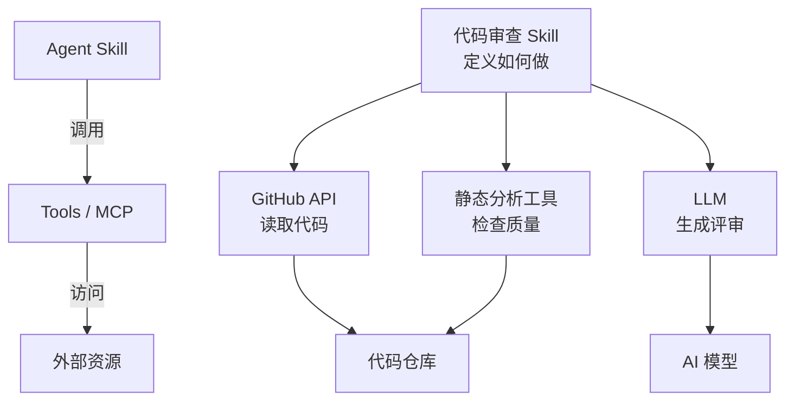
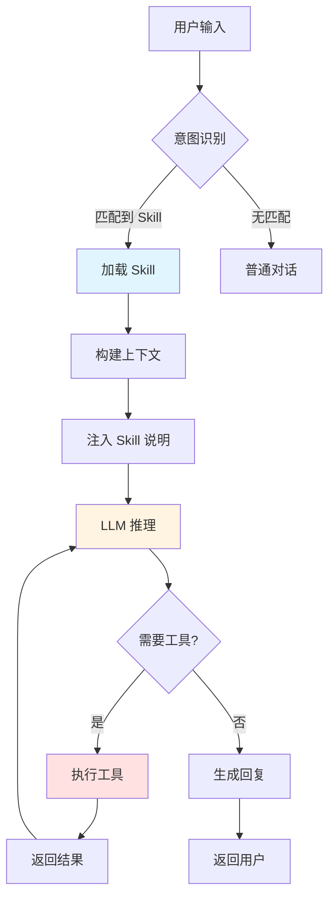

# AI Agent Skills 完全入门 - 让 AI 从"知道"到"会做"

当你让 ChatGPT 帮你写代码时，它能给出建议；但当你让 Claude Code 提交代码时，它不仅能分析改动、生成 commit message，还能直接执行 `git commit` 命令。这背后的差异就在于 **Agent Skills**。

本文将系统讲解 Skills 的核心概念、工作原理，并通过实战案例帮助你快速上手，让你的 AI Agent 从"纸上谈兵"变成"实战高手"。

## 1. 什么是 Agent Skills

### 1.1 一个实际场景

让我们从一个真实场景开始理解 Skills：

**场景：Git 提交代码**

```
【没有 Skills 的 AI】
用户："帮我提交代码"
AI："你可以这样做：
     1. 运行 git add .
     2. 运行 git commit -m '你的提交信息'
     3. 建议使用清晰的提交信息..."

→ 只能提供建议，需要用户手动执行

【有 Skills 的 AI】
用户："帮我提交代码"
AI："好的，让我帮你：
     [执行] git status
     [执行] git diff
     [分析] 发现修改了 3 个文件，主要是优化了用户认证逻辑
     [生成] feat(auth): 优化用户认证流程

     这个提交信息可以吗？(y/n)"
用户："y"
AI："[执行] git add src/auth.js src/middleware.js tests/auth.test.js
     [执行] git commit -m 'feat(auth): 优化用户认证流程'
     ✓ 提交成功！"

→ 完整的工作流，从分析到执行
```

**差异本质**：
- 前者：LLM 的知识能力（知道怎么做）
- 后者：Skills 赋予的执行能力（真的能做）

### 1.2 Skills 的本质

**Agent Skills** 是为 AI Agent 提供**可重用的专业知识包**，让 AI 不仅"知道"该怎么做，还"能够"真正执行。

用一个类比来理解：

| 角色 | 类比 | 说明 |
|------|------|------|
| **LLM** | 博学的大学生 | 知识渊博，能回答各种问题，但缺乏实践经验 |
| **Skills** | 专业技能培训 | 教授"如何编写规范 commit"、"如何审查代码质量" |
| **有 Skills 的 Agent** | 资深工程师 | 既有理论知识，又有丰富的实战经验和工具 |

**Skills 解决的三大核心问题**：

1. **知识截止问题**
   - ❌ LLM：训练数据有截止日期，不知道最新技术
   - ✅ Skills：通过工具实时获取信息（API 调用、文件读取）

2. **缺乏执行能力**
   - ❌ LLM：只能生成文本，无法执行命令
   - ✅ Skills：绑定工具函数，真正执行操作

3. **流程不清晰**
   - ❌ LLM：对复杂任务可能遗漏步骤
   - ✅ Skills：预定义完整工作流，确保不漏步骤

### 1.3 Skills vs Tools vs MCP：术语辨析

在 AI Agent 生态中，这些术语经常被混用，但它们有明确的区别：

| 概念 | 定义 | 举例 | 特点 |
|------|------|------|------|
| **Tools** | 单个功能函数 | `get_weather(city)` | 原子操作，只做一件事 |
| **MCP** | 连接 AI 与外部系统的协议 | GitHub MCP Server | 提供一组工具的标准接口 |
| **Skills** | 工作流 + 领域知识 | "代码审查 Skill" | 定义完整的执行流程和最佳实践 |

**层次关系图**：



**一句话总结**：
- **Skills**：教 AI "怎么做"（工作流、最佳实践）
- **Tools/MCP**：给 AI "能力"（调用 API、访问数据）
- **两者结合**：才是完整的 Agent 系统

### 1.4 为什么需要 Skills

**问题 1：为什么不直接用 Prompt？**

```markdown
# 方式 A：每次都写详细 Prompt
用户："帮我提交代码，要遵循 conventional commits 规范，
     先看 git status，再看 git diff，然后..."

# 方式 B：使用 Skill
用户："/commit"

→ Skills 就是"可重用的 Prompt + 工具绑定"
```

**问题 2：为什么不直接用 Function Calling？**

Function Calling 只解决了"调用工具"，但没有解决：
- ✗ 何时调用哪个工具（需要明确指示）
- ✗ 工具的调用顺序（需要每次说明）
- ✗ 领域知识和最佳实践（需要反复强调）

Skills = Function Calling + 工作流定义 + 领域知识

## 2. Skills 的工作原理

### 2.1 核心机制

Skills 通过以下三种机制增强 AI Agent 的能力：

#### 机制一：上下文注入

**原理**：将 Skill 的说明注入到 LLM 的 System Prompt 中

```
原始 Prompt：
"你是一个有帮助的 AI 助手。"

加载 Skill 后：
"你是一个有帮助的 AI 助手。

# Git Commit Skill
当用户要提交代码时，按以下步骤操作：
1. 执行 git status 查看改动
2. 执行 git diff 分析具体变更
3. 查看最近 3 次 commit 了解项目风格
4. 生成符合 Conventional Commits 的 message
5. 询问用户确认后执行提交

注意：
- 使用现在时态："Add feature" 而非 "Added feature"
- 第一行不超过 50 字符
- 遵循项目现有风格"
```

**效果**：LLM 就像阅读了一份操作手册，知道在什么情况下该做什么。

#### 机制二：工具调用（Tool Calling）

**原理**：LLM 输出特定格式 → 系统解析 → 执行函数 → 返回结果

```typescript
// LLM 的输出（简化示例）
{
  "tool": "bash",
  "command": "git status"
}

// 系统执行
const result = await executeBash("git status");

// 结果返回给 LLM
"On branch main
 Changes not staged for commit:
   modified: src/auth.js"

// LLM 继续推理
"我看到修改了 auth.js，让我看看具体改动..."
```

**关键点**：
- LLM 不直接执行命令，只是"请求"执行
- 系统负责实际执行并返回结果
- 多轮对话，直到任务完成

#### 机制三：工作流编排

**原理**：预定义任务的执行步骤和逻辑

```yaml
workflow:
  - step: check_changes
    tool: bash
    command: "git status"

  - step: analyze_diff
    tool: bash
    command: "git diff"

  - step: check_style
    tool: bash
    command: "git log -5 --oneline"

  - step: generate_message
    tool: llm
    instruction: "基于以上信息生成 commit message"

  - step: confirm
    tool: ask_user

  - step: commit
    tool: bash
    command: "git commit -m '{message}'"
    condition: user_confirmed
```

### 2.2 完整生命周期

一个 Skill 从触发到完成的完整流程：



**详细步骤解析**：

1. **意图识别**（Trigger Matching）
   ```
   输入："/commit" 或 "帮我提交代码"
   匹配：检查是否有对应的 Skill
   结果：加载 commit Skill
   ```

2. **上下文构建**（Context Building）
   ```
   基础 Prompt + Skill 说明 + 相关文件（references/）
   ```

3. **LLM 推理**（Reasoning）
   ```
   理解任务 → 规划步骤 → 决定下一步动作
   ```

4. **工具执行**（Tool Execution）
   ```
   LLM 输出：{"tool": "bash", "command": "git status"}
   系统执行：result = exec("git status")
   返回给 LLM：result
   ```

5. **多轮迭代**（Iteration）
   ```
   LLM → 工具 → 结果 → LLM → 工具 → ...
   直到任务完成
   ```

### 2.3 实战案例：剖析 Commit Skill

让我们深入分析一个真实的 Skill 是如何工作的。

#### Skill 定义（SKILL.md）

```markdown
---
name: commit
description: 智能分析代码变更并生成规范的 Git commit message
---

# Git Commit Skill

## 触发方式
- Slash 命令：`/commit`
- 自然语言：用户说"提交代码"、"创建 commit"等

## 工作流程

### 第一步：检查当前状态
执行 `git status` 了解：
- 哪些文件被修改
- 哪些在暂存区
- 是否有未跟踪文件

### 第二步：分析具体改动
执行 `git diff` 查看：
- 增加了哪些代码
- 删除了哪些代码
- 修改的核心逻辑

### 第三步：学习项目风格
执行 `git log -5 --oneline` 观察：
- 项目使用什么 commit 规范（如 Conventional Commits）
- 常用的 type（feat/fix/docs 等）
- 描述的详细程度

### 第四步：生成 commit message
基于以上信息，生成符合以下规范的 message：
- 格式：`<type>(<scope>): <subject>`
- type：feat/fix/docs/style/refactor/test/chore
- subject：简洁描述（<50 字符），使用现在时
- body（可选）：详细说明为什么改、怎么改

### 第五步：用户确认
显示生成的 message，询问用户是否满意。

### 第六步：执行提交
用户确认后：
1. 执行 `git add <files>`（如果需要）
2. 执行 `git commit -m "<message>"`
3. 显示提交成功信息

## 工具权限
- Bash：执行 git 命令
- Read：读取项目文件以更好理解上下文

## 注意事项
- **不要**自动 push，除非用户明确要求
- **不要**提交 .env、密钥等敏感文件
- **总是**在执行前让用户确认
```

#### 执行流程演示

```
【第1轮对话】
用户："/commit"

LLM（内心）：触发了 commit skill，按照流程第一步
LLM（输出）：
  tool: bash
  command: "git status"

系统执行 → 返回结果：
  "On branch main
   Changes not staged:
     modified: src/auth.js
     modified: tests/auth.test.js"

【第2轮对话】
LLM（内心）：看到改动，执行第二步
LLM（输出）：
  tool: bash
  command: "git diff src/auth.js"

系统执行 → 返回结果：
  "+ function validateToken(token) { ... }
   - function checkToken(token) { ... }"

【第3轮对话】
LLM（内心）：理解改动，执行第三步
LLM（输出）：
  tool: bash
  command: "git log -5 --oneline"

系统执行 → 返回结果：
  "feat(auth): add JWT support
   fix(user): resolve login issue
   docs: update API documentation"

【第4轮对话】
LLM（内心）：项目使用 Conventional Commits，生成 message
LLM（输出文本）：
  "我分析了代码改动，建议使用以下 commit message：

   feat(auth): 重构 token 验证逻辑

   - 将 checkToken 重命名为 validateToken，语义更清晰
   - 添加了对过期 token 的检查
   - 更新了相关测试用例

   这个 message 可以吗？(y/n)"

【第5轮对话】
用户："y"

LLM（输出）：
  tool: bash
  command: "git add src/auth.js tests/auth.test.js &&
           git commit -m 'feat(auth): 重构 token 验证逻辑...'"

系统执行 → 返回结果：
  "[main 7a9f3c2] feat(auth): 重构 token 验证逻辑
   2 files changed, 15 insertions(+), 8 deletions(-)"

LLM（输出文本）：
  "✓ 提交成功！
   Commit ID: 7a9f3c2"
```

#### 为什么这样设计

**设计亮点分析**：

1. **多步骤验证**
   - ✅ 不直接生成 message，先收集信息
   - ✅ 学习项目风格，而非使用固定模板
   - ✅ 用户确认环节，避免错误提交

2. **上下文感知**
   - ✅ 读取 `git log` 学习项目规范
   - ✅ 分析 `git diff` 理解改动本质
   - ✅ 生成的 message 符合项目风格

3. **安全考虑**
   - ✅ 不自动 push
   - ✅ 提交前必须确认
   - ✅ 可以指定要提交的文件

**如果没有 Skill，会怎样？**

```
用户："帮我提交代码"
LLM："好的，运行 git commit -m 'update code'"

→ 没有分析改动
→ 没有学习项目风格
→ commit message 质量低
→ 可能提交敏感文件
```

## 3. 动手实践：创建你的第一个 Skill

### 3.1 环境准备

**选项 A：使用 Claude Code CLI**（推荐）

```bash
# 安装 Claude Code CLI（npm 方式已弃用，官方推荐原生安装器）
curl -fsSL https://claude.ai/install.sh | bash

# 初始化项目
claude init

# 创建 Skill 目录
mkdir -p .claude/skills/weather-assistant
```

**选项 B：使用 Cursor / 其他支持 Skills 的编辑器**

确保编辑器支持 Agent Skills 功能。

**目录结构**：

```
project/
├── .claude/
│   └── skills/
│       └── weather-assistant/
│           ├── SKILL.md          # 核心文件
│           ├── references/       # 可选：参考文档
│           └── assets/           # 可选：资源文件
```

### 3.2 案例：创建天气助手 Skill

#### 步骤 1：定义需求

我们要创建一个 Skill，让 AI 能够：
- 获取指定城市的天气
- 提供天气建议（是否适合外出、穿衣建议）
- 支持多城市对比

#### 步骤 2：编写 SKILL.md

创建文件：`.claude/skills/weather-assistant/SKILL.md`

```markdown
---
name: weather-assistant
description: 获取实时天气并提供生活建议
---

# 天气助手 Skill

## 触发条件
当用户询问天气相关问题时自动触发，例如：
- "北京今天天气怎么样"
- "上海明天会下雨吗"
- "/weather 深圳"

## 工作流程

### 第一步：识别城市
从用户输入中提取城市名称。如果未指定，询问用户。

### 第二步：调用天气 API
使用 `get_weather` 工具获取实时天气数据：
- 温度（当前/最高/最低）
- 天气状况（晴/雨/雪/雾等）
- 湿度、风速
- 空气质量指数（AQI）

### 第三步：分析并生成建议
基于天气数据，提供实用建议：
- **温度建议**：
  - < 10°C：提醒穿厚外套
  - 10-20°C：建议穿长袖
  - > 30°C：提醒防晒、多喝水

- **天气状况建议**：
  - 下雨：携带雨具
  - 雾霾（AQI > 150）：戴口罩，减少户外活动
  - 晴天：适合外出

### 第四步：格式化输出
使用清晰的格式展示信息：
```
📍 城市：北京
🌡️ 温度：15°C（10°C ~ 18°C）
🌤️ 天气：多云
💨 风速：3级
💧 湿度：60%
🏭 空气质量：良（AQI 55）

💡 建议：
- 适合外出活动
- 建议穿长袖衬衫或薄外套
- 紫外线适中，注意防晒
```

## 工具使用

### get_weather(city: string)
获取指定城市的实时天气数据。

**参数**：
- `city`：城市名称（支持中英文）

**返回**：
```json
{
  "city": "北京",
  "temp": 15,
  "temp_min": 10,
  "temp_max": 18,
  "weather": "多云",
  "humidity": 60,
  "wind_speed": 3,
  "aqi": 55
}
```

## 注意事项
- 温度单位默认使用摄氏度（°C）
- 如果 API 调用失败，礼貌告知用户并建议稍后重试
- 不要捏造天气数据
```

#### 步骤 3：实现工具函数

创建文件：`.claude/skills/weather-assistant/tools.ts`

```typescript
// 天气 API 工具函数
export async function get_weather(city: string) {
  try {
    // 这里使用真实的天气 API（示例使用 OpenWeatherMap）
    const API_KEY = process.env.WEATHER_API_KEY;
    const url = `https://api.openweathermap.org/data/2.5/weather?q=${city}&appid=${API_KEY}&units=metric&lang=zh_cn`;

    const response = await fetch(url);
    const data = await response.json();

    if (data.cod !== 200) {
      return {
        error: true,
        message: `无法获取 ${city} 的天气信息`
      };
    }

    return {
      city: data.name,
      temp: Math.round(data.main.temp),
      temp_min: Math.round(data.main.temp_min),
      temp_max: Math.round(data.main.temp_max),
      weather: data.weather[0].description,
      humidity: data.main.humidity,
      wind_speed: Math.round(data.wind.speed * 3.6), // m/s to km/h
      aqi: await getAQI(city) // 另一个 API 获取空气质量
    };
  } catch (error) {
    console.error('Weather API error:', error);
    return {
      error: true,
      message: 'API 调用失败，请稍后重试'
    };
  }
}

async function getAQI(city: string): Promise<number> {
  // 调用空气质量 API
  // 这里简化处理，实际应该调用真实 API
  return 55;
}

// 导出工具定义（给 LLM 使用）
export const weatherTools = [
  {
    name: 'get_weather',
    description: '获取指定城市的实时天气信息',
    input_schema: {
      type: 'object',
      properties: {
        city: {
          type: 'string',
          description: '城市名称（中文或英文）'
        }
      },
      required: ['city']
    }
  }
];
```

#### 步骤 4：注册 Skill

创建文件：`.claude/skills/weather-assistant/index.ts`

```typescript
import { weatherTools, get_weather } from './tools';
import { readFileSync } from 'fs';
import { join } from 'path';

export class WeatherSkill {
  name = 'weather-assistant';
  description = '获取实时天气并提供生活建议';

  // 加载 SKILL.md 内容
  systemPrompt: string;

  constructor() {
    const skillPath = join(__dirname, 'SKILL.md');
    this.systemPrompt = readFileSync(skillPath, 'utf-8');
  }

  // 工具定义
  get tools() {
    return weatherTools;
  }

  // 工具处理器
  async handleToolCall(toolName: string, params: any) {
    switch (toolName) {
      case 'get_weather':
        return await get_weather(params.city);
      default:
        throw new Error(`Unknown tool: ${toolName}`);
    }
  }

  // 匹配触发条件
  match(userInput: string): boolean {
    const keywords = ['天气', '温度', '下雨', '晴天', '气温', 'weather'];
    return keywords.some(kw => userInput.toLowerCase().includes(kw)) ||
           userInput.startsWith('/weather');
  }
}
```

#### 步骤 5：测试 Skill

创建测试文件：`test-weather-skill.ts`

```typescript
import Anthropic from '@anthropic-ai/sdk';
import { WeatherSkill } from './.claude/skills/weather-assistant';

const client = new Anthropic({
  apiKey: process.env.ANTHROPIC_API_KEY
});

async function testWeatherSkill() {
  const skill = new WeatherSkill();

  const userInput = "北京今天天气怎么样？";

  // 检查是否匹配
  if (!skill.match(userInput)) {
    console.log('未匹配到天气 Skill');
    return;
  }

  console.log('✓ 匹配到天气 Skill');

  // 构建消息
  const messages: Anthropic.MessageParam[] = [
    { role: 'user', content: userInput }
  ];

  // 多轮对话
  while (true) {
    const response = await client.messages.create({
      model: 'claude-sonnet-5',
      max_tokens: 4096,
      system: skill.systemPrompt,
      tools: skill.tools,
      messages
    });

    console.log('\n--- LLM Response ---');
    console.log(JSON.stringify(response.content, null, 2));

    // 检查是否有工具调用
    const toolUse = response.content.find(c => c.type === 'tool_use');

    if (!toolUse || toolUse.type !== 'tool_use') {
      // 没有工具调用，任务完成
      const textContent = response.content.find(c => c.type === 'text');
      console.log('\n--- Final Answer ---');
      console.log(textContent?.text);
      break;
    }

    // 执行工具
    console.log(`\n--- Executing Tool: ${toolUse.name} ---`);
    const result = await skill.handleToolCall(toolUse.name, toolUse.input);
    console.log('Tool result:', result);

    // 将结果返回给 LLM
    messages.push({
      role: 'assistant',
      content: response.content
    });
    messages.push({
      role: 'user',
      content: [{
        type: 'tool_result',
        tool_use_id: toolUse.id,
        content: JSON.stringify(result)
      }]
    });
  }
}

// 运行测试
testWeatherSkill().catch(console.error);
```

运行测试：

```bash
# 设置环境变量
export ANTHROPIC_API_KEY="your-api-key"
export WEATHER_API_KEY="your-weather-api-key"

# 运行测试
ts-node test-weather-skill.ts
```

**预期输出**：

```
✓ 匹配到天气 Skill

--- LLM Response ---
[
  {
    "type": "tool_use",
    "name": "get_weather",
    "input": { "city": "北京" }
  }
]

--- Executing Tool: get_weather ---
Tool result: {
  city: '北京',
  temp: 15,
  temp_min: 10,
  temp_max: 18,
  weather: '多云',
  humidity: 60,
  wind_speed: 12,
  aqi: 55
}

--- LLM Response ---
[
  {
    "type": "text",
    "text": "📍 城市：北京\n🌡️ 温度：15°C（10°C ~ 18°C）\n..."
  }
]

--- Final Answer ---
📍 城市：北京
🌡️ 温度：15°C（10°C ~ 18°C）
🌤️ 天气：多云
💨 风速：12 km/h
💧 湿度：60%
🏭 空气质量：良（AQI 55）

💡 建议：
- 适合外出活动
- 建议穿长袖衬衫或薄外套
- 紫外线适中，注意防晒
```

### 3.3 调试技巧

**技巧 1：查看完整对话日志**

```typescript
// 在每次 API 调用前后打印日志
console.log('=== Request ===');
console.log(JSON.stringify(messages, null, 2));

const response = await client.messages.create({...});

console.log('=== Response ===');
console.log(JSON.stringify(response, null, 2));
```

**技巧 2：逐步验证工具函数**

```typescript
// 先单独测试工具函数
const result = await get_weather('北京');
console.log(result);
// 确认返回格式正确后，再集成到 Skill
```

**技巧 3：使用 Claude 的思考过程**

启用 extended thinking（如果支持）：

```typescript
const response = await client.messages.create({
  model: 'claude-sonnet-5',
  max_tokens: 4096,
  thinking: {
    type: 'enabled',
    budget_tokens: 2000
  },
  // ...
});

// 查看 LLM 的思考过程
const thinking = response.content.find(c => c.type === 'thinking');
console.log('LLM 思考:', thinking?.thinking);
```

## 4. 最佳实践与常见问题

### 4.1 设计原则

#### 原则 1：单一职责

**❌ 不好的设计**：

```markdown
# 超级助手 Skill
- 发送邮件
- 查询天气
- 创建日历事件
- 翻译文本
- 生成图片
```

**✅ 好的设计**：

```markdown
# Email Sender Skill - 只负责发邮件
# Weather Skill - 只负责天气
# Calendar Skill - 只负责日历
```

**原因**：
- 易于维护和调试
- 触发条件更精确
- 可以独立更新

#### 原则 2：清晰的触发条件

**❌ 触发条件过于宽泛**：

```markdown
## 触发条件
当用户需要帮助时触发。
```

→ 任何问题都可能触发，导致误触发

**✅ 明确的触发条件**：

```markdown
## 触发条件
满足以下任一条件时触发：
- 用户输入 `/weather`
- 用户消息包含关键词："天气"、"温度"、"下雨"、"气温"
- 用户询问某个城市的天气情况

**不触发**的情况：
- 询问历史天气（超出能力）
- 询问天气预测原理（科普问题，非工具使用）
```

#### 原则 3：用户确认关键操作

**危险操作必须确认**：

```typescript
// ❌ 直接执行
await deleteFile(filePath);

// ✅ 先确认
const confirmed = await askUser(
  `确认删除 ${filePath}？此操作不可恢复。(y/n)`
);
if (confirmed === 'y') {
  await deleteFile(filePath);
  return '文件已删除';
} else {
  return '操作已取消';
}
```

**哪些操作需要确认？**
- 删除文件/数据
- Git push
- 发送邮件/消息
- 修改配置文件
- 执行付费 API

### 4.2 常见坑点

#### 坑点 1：忘记处理错误

**问题代码**：

```typescript
export async function send_email(to: string, subject: string) {
  const result = await emailAPI.send({ to, subject });
  return '邮件已发送';
}
```

**问题**：如果 API 调用失败，用户会收到错误的反馈。

**正确做法**：

```typescript
export async function send_email(to: string, subject: string) {
  try {
    const result = await emailAPI.send({ to, subject });

    if (!result.success) {
      return {
        success: false,
        error: `发送失败：${result.error}`
      };
    }

    return {
      success: true,
      message: `邮件已发送到 ${to}`
    };
  } catch (error) {
    console.error('Email API error:', error);
    return {
      success: false,
      error: 'API 调用失败，请检查网络连接'
    };
  }
}
```

#### 坑点 2：权限设置不当

**风险示例**：

```markdown
## 工具权限
- 完全的文件系统访问
- 执行任意 bash 命令
```

→ 如果 LLM 被注入恶意指令，可能造成严重后果

**安全做法**：

```markdown
## 工具权限
- 文件系统：只读访问 `src/` 和 `docs/` 目录
- Bash：只允许 `git` 和 `npm` 命令
- 网络：只能访问白名单 API（api.github.com、api.weather.com）
```

#### 坑点 3：缺少执行日志

**问题**：出错时无法追踪原因。

**解决方案**：

```typescript
class SkillExecutor {
  async execute(skill: Skill, input: string) {
    const executionId = crypto.randomUUID();

    console.log(`[${executionId}] 开始执行 ${skill.name}`);
    console.log(`[${executionId}] 用户输入: ${input}`);

    try {
      // ... 执行逻辑

      console.log(`[${executionId}] 执行成功`);
    } catch (error) {
      console.error(`[${executionId}] 执行失败:`, error);
      throw error;
    }
  }
}
```

### 4.3 性能优化

#### 优化 1：减少上下文长度

**问题**：SKILL.md 太长，占用大量 tokens。

**解决方案**：使用 references 目录

```
weather-assistant/
├── SKILL.md              # 核心流程（简短）
└── references/
    ├── api-docs.md       # API 详细文档（按需加载）
    └── examples.md       # 示例（按需加载）
```

在 SKILL.md 中：

```markdown
## API 使用
详见 `references/api-docs.md`

## 示例
详见 `references/examples.md`
```

LLM 会在需要时自动读取 references 文件。

#### 优化 2：缓存工具结果

```typescript
const cache = new Map();

export async function get_weather(city: string) {
  const cacheKey = `weather:${city}`;

  // 检查缓存（5分钟有效）
  const cached = cache.get(cacheKey);
  if (cached && Date.now() - cached.time < 5 * 60 * 1000) {
    return cached.data;
  }

  // 调用 API
  const data = await fetchWeather(city);

  // 存入缓存
  cache.set(cacheKey, { data, time: Date.now() });

  return data;
}
```

## 5. 获取与分享 Skills

### 5.1 从哪里找现成的 Skills

#### 选项 1：GitHub 搜索

**搜索关键词**：
- `claude skills`
- `agent skills`
- `anthropic skills`
- `mcp server`

**热门仓库**：
- `anthropics/claude-code` - 官方示例
- `modelcontextprotocol/servers` - MCP Server 集合
- 社区贡献的各类 Skills

**示例**：

```bash
# 克隆仓库
git clone https://github.com/user/awesome-skills.git

# 复制到你的项目
cp -r awesome-skills/commit-skill .claude/skills/
```

#### 选项 2：MCP 生态

**官方资源**：
- **MCP Servers 列表**：https://modelcontextprotocol.io/servers
- **GitHub 组织**：https://github.com/modelcontextprotocol

**热门 MCP Servers**：

| Server | 功能 | 安装 |
|--------|------|------|
| `@modelcontextprotocol/server-filesystem` | 文件系统操作 | `npm install @modelcontextprotocol/server-filesystem` |
| `@modelcontextprotocol/server-github` | GitHub 集成 | `npm install @modelcontextprotocol/server-github` |
| `@modelcontextprotocol/server-postgres` | 数据库查询 | `npm install @modelcontextprotocol/server-postgres` |

**使用 MCP Server**：

```typescript
// 在 Skill 中使用 MCP Server 提供的工具
import { createMCPClient } from '@modelcontextprotocol/sdk';

const client = await createMCPClient({
  server: '@modelcontextprotocol/server-github',
  config: {
    token: process.env.GITHUB_TOKEN
  }
});

// 获取可用工具
const tools = await client.listTools();
```

#### 选项 3：社区平台

**Claude Skills Community**（非官方）：
- 搜索 Discord/Reddit 上的 Claude 社区
- 寻找 Skills 分享帖

### 5.2 如何分享你的 Skill

#### 步骤 1：标准化格式

确保你的 Skill 遵循标准格式：

```
your-skill/
├── SKILL.md              # 必需
├── README.md             # 必需：使用说明
├── tools.ts              # 可选：工具实现
├── references/           # 可选
├── assets/               # 可选
└── examples/             # 推荐：使用示例
    └── example.md
```

#### 步骤 2：编写清晰的 README

```markdown
# Weather Assistant Skill

获取实时天气并提供生活建议。

## 功能
- ✅ 实时天气查询
- ✅ 温度、湿度、风速
- ✅ 空气质量指数
- ✅ 生活建议

## 安装

\```bash
# 复制到项目
cp -r weather-assistant .claude/skills/

# 安装依赖（如有）
npm install
\```

## 配置

需要设置环境变量：

\```bash
export WEATHER_API_KEY="your-key"
\```

获取 API Key：https://openweathermap.org/api

## 使用

\```
用户："北京今天天气怎么样？"
AI："📍 城市：北京..."
\```

## 许可证
MIT
```

#### 步骤 3：发布到 GitHub

```bash
# 初始化仓库
git init
git add .
git commit -m "feat: initial commit"

# 推送到 GitHub
git remote add origin https://github.com/yourusername/weather-skill.git
git push -u origin main
```

#### 步骤 4：添加 Topic 标签

在 GitHub 仓库设置中添加：
- `claude-skills`
- `agent-skills`
- `anthropic`
- `ai-agent`

这样其他人可以更容易找到你的 Skill。

## 6. 总结与下一步

### 6.1 本文回顾

我们系统学习了 AI Agent Skills：

**核心概念**：
- ✅ Skills 是可重用的专业知识包
- ✅ 让 AI 从"知道"到"会做"
- ✅ Skills ≠ Tools ≠ MCP（层次关系）

**工作原理**：
- ✅ 上下文注入：教 AI 怎么做
- ✅ 工具调用：让 AI 真正执行
- ✅ 工作流编排：确保步骤完整

**实战技能**：
- ✅ 剖析了 Commit Skill 的完整流程
- ✅ 从零创建了 Weather Skill
- ✅ 掌握了设计原则和最佳实践

### 6.2 推荐学习路径

**🔰 初学者路径**（1-2 周）

1. **理解基础**
   - 阅读本文前两章
   - 安装 Claude Code CLI
   - 尝试使用现有 Skills

2. **动手实践**
   - 按照第 3 章创建 Weather Skill
   - 修改参数，测试不同城市
   - 添加新功能（如未来 7 天预报）

3. **学习案例**
   - 研究 2-3 个开源 Skills
   - 理解它们的设计思路
   - 尝试改进或定制

**🚀 进阶路径**（2-4 周）

1. **探索 MCP 生态**
   - 学习 MCP 协议：https://modelcontextprotocol.io
   - 安装并使用 3-5 个 MCP Servers
   - 理解 Skills + MCP 的协同

2. **创建复杂 Skill**
   - 多步骤工作流（如完整的代码审查流程）
   - 集成多个 MCP Servers
   - 添加错误处理和日志

3. **贡献开源**
   - 将你的 Skill 开源到 GitHub
   - 编写详细文档
   - 收集社区反馈并迭代

**🎯 高级路径**（1-3 个月）

1. **构建 Skills 系统**
   - 设计 Skill 加载器
   - 实现语义匹配引擎
   - 添加权限管理

2. **Skills Marketplace**
   - 设计 Skill 发现机制
   - 实现安装/更新功能
   - 添加审核和评级系统

3. **跨平台兼容**
   - 让你的 Skills 在多个平台运行
   - 遵循开放标准
   - 贡献到社区规范

### 6.3 参考资源

**官方文档**：
- [Model Context Protocol](https://modelcontextprotocol.io)
- [Anthropic Claude API](https://docs.anthropic.com)
- [Claude Code CLI](https://github.com/anthropics/claude-code)

**技术文章**：
- [Understanding Agent Skills](https://www.anthropic.com/news/agent-skills)
- [MCP in Practice](https://modelcontextprotocol.io/docs/guides)

**社区资源**：
- [MCP GitHub Organization](https://github.com/modelcontextprotocol)
- [Claude Discord Community](https://discord.gg/anthropic)

**学习项目**：
- [Awesome Claude Skills](https://github.com/topics/claude-skills)
- [MCP Server Examples](https://github.com/modelcontextprotocol/servers)

---

**下一步行动**：

选择一个适合你的起点：

1. 🎯 **实战优先**：直接跳到第 3 章，创建你的第一个 Skill
2. 📚 **理论深入**：研究 MCP 协议和 Tool Calling 机制
3. 🔍 **案例学习**：找 3 个开源 Skills，分析它们的设计

无论选择哪个路径，最重要的是**动手实践**。Skills 的学习曲线并不陡峭，关键是迈出第一步！

祝你在 AI Agent 的世界中探索愉快！🚀
