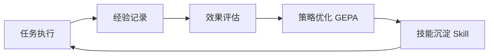
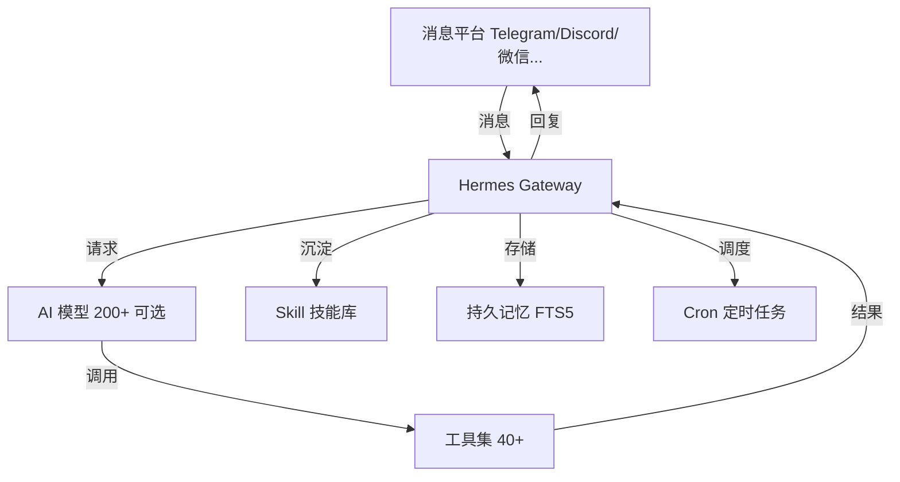

# Hermes Agent 开源 AI 智能体部署指南

市面上的 AI 助手大多像"一次性用品"：对话结束，记忆清零；换个人问，它重新开始。**Hermes Agent 想改变这件事**——它是目前少数真正内置"学习闭环"的开源智能体：完成任务后自动把过程沉淀成技能，下次遇到同类任务直接复用，越用越快，越用越懂你。

它出自 [Nous Research](https://nousresearch.com)——开源模型 Hermes、Nomos、Psyche 系列的创造者——官方定位是 "The agent that grows with you"（与你一同成长的智能体）。在 2026 年的开源 Agent 浪潮里，它用"自我进化"这个差异点，GitHub 已积累 223k+ stars。

## 1. 什么是 Hermes Agent？

### 1.1 核心定义

Hermes Agent 是一个开源的、自托管的自主 AI 智能体框架（MIT 许可证），可以部署在本地、VPS、Docker 或 Serverless 基础设施上。它的核心特征不是"更聪明的对话"，而是**持续进化的能力**：

- 从经验中创建技能（Skill）
- 在使用过程中持续改进技能
- 主动提示自己持久化知识
- 搜索自己过去的对话
- 跨会话构建对你的深度理解

用一句话概括：**传统 AI 是"用完即弃"的工具，Hermes Agent 是"越用越值钱"的同事。**

### 1.2 它不是什么

| 误解 | 真相 |
|:-----|:-----|
| 是聊天机器人封装 | 是自主智能体，运行越久能力越强 |
| 绑定 IDE 的编程副驾驶 | 可在 VPS、GPU 集群、Serverless 上运行 |
| 锁定单一 API | 支持 200+ 模型，`hermes model` 一键切换 |
| 依赖本地电脑 | 可在云端 VM 上工作，你从 Telegram 跟它对话 |

### 1.3 背后团队

Nous Research 是开源模型 Hermes、Nomos、Psyche 系列的创造者。2026 年 2 月正式发布 Hermes Agent，并完成 Paradigm 领投的 5000 万美元 A 轮融资（估值 10 亿美元）。他们的判断很直接：**聊天机器人的交互范式已经触顶，下一个方向是"持续在线的数字员工"。**

## 2. 核心特性

### 2.1 闭环学习系统（核心卖点）



Hermes Agent 是**唯一内置学习闭环**的智能体：
- 完成复杂任务后自动创建可复用的 Skill 文件
- 技能在使用过程中自我改进
- 通过 **GEPA 自我进化系统**持续优化策略——传统强化学习需上万次评估收敛，GEPA 仅需 100-500 次即可完成策略迭代
- 兼容 [agentskills.io](https://agentskills.io) 开放标准，技能可移植、可分享、可接受社区贡献

### 2.2 持久化记忆

传统 AI 助手是无状态的，对话结束一切归零。Hermes Agent 打破了这个前提：

- **跨会话持久记忆**：自动记录对话，提取关键信息保存
- **FTS5 全文检索 + LLM 摘要**：可以搜索自己过去的会话，跨会话召回
- **Honcho 辩证式用户建模**：逐步构建你的偏好、工作习惯和需求画像
- **主动提示**：会"提醒"自己持久化重要知识，而不是被动等待

### 2.3 多平台消息网关

一个网关进程，同时接入：

| 平台 | 状态 |
|:-----|:-----|
| Telegram | ✅ 推荐，易于配置 |
| Discord | ✅ |
| Slack | ✅ |
| WhatsApp | ✅ |
| Signal | ✅ |
| 飞书 / 钉钉 / 企业微信 | ✅ 国内用户可用 |
| QQ / Email | ✅ |

所有渠道共享**统一的记忆与人格**，全天候在线。还支持语音消息转录和跨平台对话连续性。

### 2.4 模型无关，零锁定

支持任意模型提供商——Nous Portal、OpenRouter（200+ 模型）、OpenAI、Anthropic Claude、DeepSeek、Hugging Face、NVIDIA NIM、小米 MiMo、z.ai/GLM、Kimi/Moonshot、MiniMax，或自定义端点。

```bash
hermes model   # 一条命令切换模型，无需改代码
```

本地场景兼容 Ollama、vLLM、SGLang。

### 2.5 随处运行

| 终端后端 | 说明 |
|:-----|:-----|
| 本地 | 笔记本/桌面直接运行 |
| Docker | 容器隔离 |
| SSH | 远程服务器 |
| Singularity | 高性能计算 |
| Modal / Daytona | **Serverless 持久化**：空闲休眠，按需唤醒，闲置时几乎零成本 |
| Vercel Sandbox | 云开发环境 |

$5 的 VPS 就能跑，GPU 集群也能跑，Serverless 基础设施闲置时成本趋近于零。

## 3. 工作原理

### 3.1 核心架构



### 3.2 学习循环细节

1. **经验记录**：执行复杂任务时记录完整过程
2. **效果评估**：评估结果质量
3. **策略优化**：GEPA 系统在 100-500 次评估内完成策略迭代
4. **技能沉淀**：将成功经验固化为可复用的 Skill 文件
5. **复用改进**：下次遇到类似任务直接调用技能，并在使用中继续改进

### 3.3 定时自动化

内置 cron 调度器，支持自然语言配置，向任意平台投递：

```bash
# 每天 8:00 发送日报
hermes cron add "每天早上8点给我发送当日日程摘要" --deliver telegram

# 每周五备份
hermes cron add "每周五下午5点执行服务器备份" --deliver slack
```

日报、夜间备份、每周巡检——全部无人值守自动运行。

### 3.4 委托与并行

可以派生隔离的子智能体（Subagent）并行处理多个工作流；通过 `execute_code` 实现程序化工具调用，把多步骤流水线压缩为单次推理调用，零上下文成本。

## 4. 与传统 AI 助手的区别

| 特性 | 传统 AI（ChatGPT/Claude 网页） | Hermes Agent |
|:-----|:-----|:-----|
| **交互方式** | 打开特定应用/网站 | 融入日常消息应用 |
| **记忆能力** | 单次会话或有限上下文 | 跨会话无限记忆 + 用户建模 |
| **学习能力** | 无（模型固定） | **学习闭环，越用越强** |
| **主动性** | 被动等待指令 | 主动推送通知、定时任务 |
| **运行位置** | 云端固定 | 本地/VPS/Serverless 任选 |
| **模型选择** | 单一厂商 | 200+ 模型自由切换 |
| **技能沉淀** | 无 | 自动创建可复用 Skill |

## 5. 如何部署 Hermes Agent

### 5.1 安装

**Linux / macOS / WSL2 / Android (Termux)：**

```bash
curl -fsSL https://hermes-agent.nousresearch.com/install.sh | bash

# 安装完成后刷新 shell
source ~/.bashrc  # 或 source ~/.zshrc
```

**Windows (PowerShell)：**

```powershell
iex (irm https://hermes-agent.nousresearch.com/install.ps1)
```

macOS / Windows 用户也可以直接下载 **Hermes Desktop** 安装器（图形界面，含 CLI 和桌面应用）。

### 5.2 快速配置

```bash
# 1. 初始化（交互式引导：选择模型提供商、配置 API Key）
hermes setup

# 2. 或直接选择模型
hermes model   # 交互式选择提供商和模型

# 3. 验证聊天
hermes
```

**推荐路径：Nous Portal**——一个订阅覆盖 300+ 模型，还附带 Tool Gateway（网页搜索、图像生成、TTS 等）。

**规则**：如果 Hermes 无法完成一次正常聊天，先不要叠加更多功能。先跑通一条干净的对话，再逐步加 gateway、cron、skills、语音、路由。

### 5.3 配置消息平台（网关）

CLI 聊天验证通过后，配置消息网关：

```bash
hermes gateway setup
```

按提示接入 Telegram / Discord / Slack / WhatsApp / Signal / 飞书 / 钉钉 / 企业微信等。之后你就可以在手机上跟它对话，而它在服务器上干活。

### 5.4 VPS 部署建议

**新手配置：**
```yaml
platform: Telegram
model: DeepSeek / GLM / Kimi (国内可达)
hosting: 5美元 VPS
integrations:
  - None (start simple)
cost: ~$5/月 (VPS) + API 按量
```

**进阶配置：**
```yaml
platform: Telegram + Slack
model: OpenRouter (按需切换 200+ 模型)
hosting: VPS + Docker 隔离
integrations:
  - MCP Server
  - Cron 定时任务
  - 浏览器自动化
```

**专业配置：**
```yaml
platform: 全平台接入
model: 多模型路由 + 本地 Ollama
hosting: Modal/Daytona Serverless (闲置近零成本)
integrations:
  - 智能家居
  - 数据库巡检
  - 批量轨迹生成 (研究用途)
```

### 5.5 Docker 部署

```dockerfile
FROM python:3.12-slim

# 安装 Hermes Agent
RUN curl -fsSL https://hermes-agent.nousresearch.com/install.sh | bash

# 数据持久化（记忆/技能/配置）
VOLUME ["/root/.hermes"]

WORKDIR /app
CMD ["hermes", "gateway", "start"]
```

```yaml
# docker-compose.yml
services:
  hermes:
    build: .
    volumes:
      - hermes-data:/root/.hermes
    restart: always
volumes:
  hermes-data:
```

## 6. 成本分析

Hermes Agent 本身**完全开源免费**（MIT），成本主要来自模型 API 和托管环境：

| 项目 | 选项 | 成本 |
|:-----|:-----|:------|
| **软件许可** | 开源免费 | $0 |
| **运行环境** | 本地电脑 | $0 |
| | VPS (基础) | $5/月 |
| | Serverless (Modal/Daytona) | 闲置近零成本 |
| **AI 模型** | 本地模型 (Ollama, 需 16GB+ 显存) | $0 |
| | API 按量 (DeepSeek/GLM 等) | $1-20/月 |
| | 高端模型 (Opus/Claude) | $20-100+/月 |

**省钱策略**：
- 高频简单任务 → 便宜模型（DeepSeek、GLM、Haiku）
- 复杂推理任务 → 高端模型（Opus、Sonnet 5）
- 隐私敏感任务 → 本地 Ollama（零 API 费用）
- Serverless 部署 → 空闲休眠，按需唤醒

## 7. 实际应用场景

**场景一：个人数字管家**
- 每天 8:00 自动发送日程摘要到 Telegram
- 检测重要邮件立即通知
- 定期提醒待办事项

**场景二：服务器巡检员**
- 每周自动检查 VPS 磁盘、内存、服务状态
- 异常时主动推送告警
- 自动执行备份并报告结果

**场景三：研究助手**
- 批量收集资料、生成摘要
- 将研究流程沉淀为 Skill，下次一键复用
- 轨迹导出用于训练下一代 tool-calling 模型

**场景四：团队协作机器人**
- 接入 Slack/飞书/钉钉
- 统一记忆多个成员的偏好
- 定时生成周报、巡检报告

## 8. 安全机制

Hermes Agent v0.5.0 做了专项安全强化，合并 200+ 安全补丁：

- 命令审批（危险操作需确认）
- Docker 容器沙箱隔离
- 路径遍历防护
- SSRF 缓解
- 凭证管理
- 保持零 CVE 记录

> "进化能力强大，但缰绳必须在人手中。"

## 9. 总结

Hermes Agent 的核心价值一句话：**它是唯一自带学习闭环的 AI 智能体**——从经验中创建技能、在使用中改进技能、跨会话记住你、支持 200+ 模型、跑在任何基础设施上。

适合人群：
- 想体验"越用越聪明"的 AI 助理
- 需要 24/7 在线数字员工的开发者
- 想摆脱单一模型锁定的团队
- 喜欢自己掌控数据自托管的用户

**快速开始**：
```bash
curl -fsSL https://hermes-agent.nousresearch.com/install.sh | bash
hermes setup
```

## 参考资源

- [Hermes Agent 官方网站](https://hermes-agent.nousresearch.com)
- [GitHub 仓库](https://github.com/NousResearch/hermes-agent)（223k+ stars，MIT）
- [官方文档](https://hermes-agent.nousresearch.com/docs)
- [Nous Research](https://nousresearch.com)
- [agentskills.io 技能标准](https://agentskills.io)
- [OpenRouter 模型路由](https://openrouter.ai)
