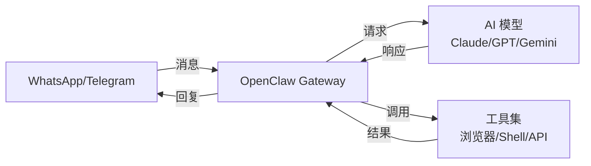
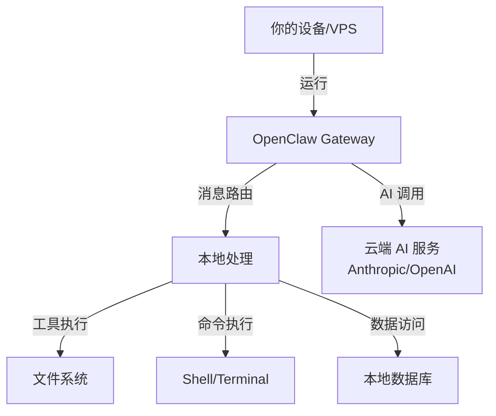
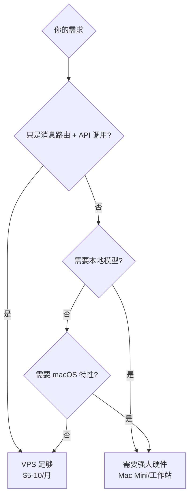
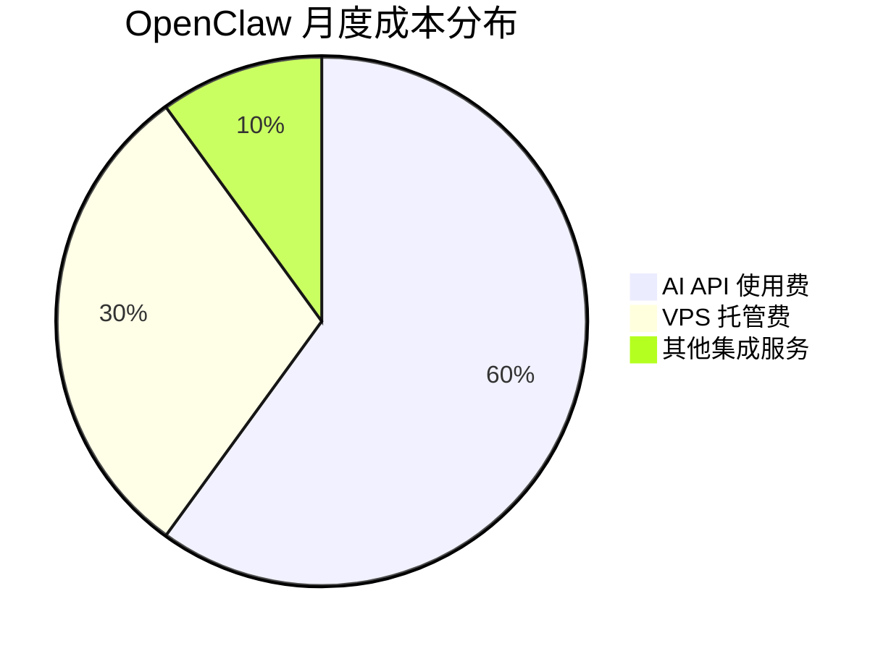
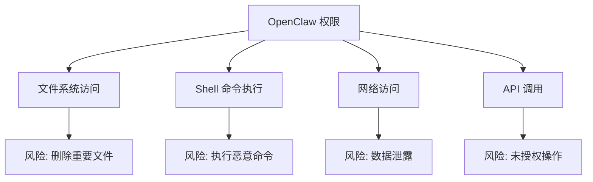
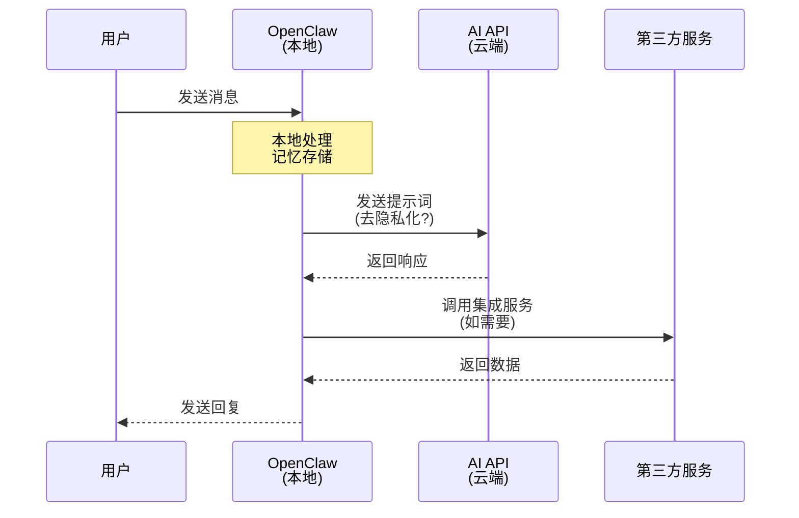

# OpenClaw 开源 AI 助理部署指南

想象一下，你有一个 AI 助理，它不仅记得你上周说过的话，还能在你还没开口前就主动提醒你重要事项，甚至可以帮你完成电脑上的各种任务——订餐厅、管理邮件、控制智能家居、生成报告。这不再是科幻电影，而是 **OpenClaw** 正在实现的现实。

OpenClaw 是一个开源的、消息优先的 AI 个人助理，最近在硅谷科技圈引发热议，甚至带火了 Mac mini 的销量。它与传统 AI 助手最大的区别在于：不是你去访问它，而是它融入你的日常通讯工具，成为真正的"24/7 在线员工"。

## 1. 什么是 OpenClaw？

### 1.1 核心定义

**OpenClaw** 是一个自托管的、本地优先的 AI 助理代理（AI Agent），可以运行在你自己的设备上（Mac、Linux 或 Windows/WSL2），作为一个强大的、始终在线的个人助手。

与 ChatGPT、Claude 等需要打开网页或应用的 AI 工具不同，OpenClaw 的设计理念是：

> 你的 AI 助理应该像真实同事一样，**存在于你的消息应用中**，随时待命，持续记忆，主动服务。

### 1.2 与传统 AI 助手的区别

| 特性 | 传统 AI（ChatGPT/Siri） | OpenClaw |
|:-----|:----------------------|:---------|
| **交互方式** | 打开特定应用/网站 | 通过常用消息应用（WhatsApp/Telegram） |
| **记忆能力** | 单次会话或有限上下文 | 无限长期记忆，跨会话保持 |
| **主动性** | 被动等待指令 | 可主动推送通知和提醒 |
| **计算机控制** | 无法操作本地系统 | 完全控制运行设备 |
| **数据隐私** | 数据存储在云端 | 本地运行，数据自主控制 |
| **可定制性** | 功能固定 | 开源，可自由扩展 |

### 1.3 三大核心特性

**1. 持久化记忆（Persistent Memory）**

OpenClaw 拥有复杂的内置记忆系统，会自动记录所有对话，提取关键信息并保存为 Markdown 格式的"记忆文件"。随着时间推移，它会越来越了解你的偏好、工作习惯和需求。

**2. 主动通知（Proactive Notifications）**

这是最令人兴奋的功能：OpenClaw 可以在你没有询问的情况下主动推送信息。例如：
- 每天早上 8 点自动发送当日日程摘要
- 检测到重要邮件时立即通知
- 定期提醒待办事项
- 监控系统状态并预警

**3. 任务自动化（Task Automation）**

因为 OpenClaw 运行在你的计算机上，它可以：
- 执行 Shell 命令
- 操作浏览器（填写表单、抓取数据）
- 管理文件系统
- 调用各种 API
- 控制智能家居设备

## 2. OpenClaw 的工作原理

### 2.1 系统架构

OpenClaw 的架构可以用一个简单的公式表示：

```
消息应用 ⇄ OpenClaw Gateway ⇄ AI 模型 + 工具
```



**工作流程说明：**

1. 你在 WhatsApp 或 Telegram 中向 OpenClaw 发送消息
2. Gateway 接收消息并决定如何处理
3. 将请求发送给配置的 AI 模型（如 Claude Opus）
4. 模型可能会调用工具（执行命令、查询数据库、控制设备）
5. 收集所有结果后，回复到原消息线程

### 2.2 为什么叫"Gateway"？

传统聊天机器人只是一个单一的对话界面，而 **Gateway（网关）** 是一个编排器（Orchestrator），它能够：

- **统一多个收件箱**：同时连接多个消息平台
- **保持状态**：记住上下文和历史
- **运行定时任务**：通过 cron 实现自动化
- **连接真实服务**：日历、邮件、笔记、智能家居等

这就是为什么 OpenClaw 能实现"主动行为"——Gateway 可以按计划检查条件，并在满足阈值时主动发消息给你。

### 2.3 本地运行的优势



**隐私优势**：
- 消息路由逻辑在你的机器上执行
- 自动化脚本和集成配置由你控制
- AI 模型调用仍需访问云端（除非使用本地模型）
- "助理大脑"和集成完全在你掌控之下

## 3. 核心功能与应用场景

### 3.1 完全的计算机控制

OpenClaw 没有传统的"护栏"限制，它几乎可以做你在计算机上能做的任何事情：

**示例：自动化文件管理**

```bash
# 你的指令：整理桌面文件
# OpenClaw 执行：
mkdir -p ~/Desktop/Organized/{Images,Documents,Code}
mv ~/Desktop/*.png ~/Desktop/Organized/Images/
mv ~/Desktop/*.pdf ~/Desktop/Organized/Documents/
mv ~/Desktop/*.js ~/Desktop/Organized/Code/
```

**示例：生成报告**

```bash
# 你的指令：生成本周工作报告
# OpenClaw 会：
1. 检查 Git 提交记录
2. 查询任务管理工具（Todoist/Notion）
3. 汇总会议日程
4. 生成 Markdown 报告
5. 发送到指定邮箱
```

### 3.2 无限长期记忆

OpenClaw 的记忆系统基于文件系统，采用 **Markdown 格式存储**：

```
/clawd/
  ├── memory/
  │   ├── 2026-01-20-daily.md
  │   ├── 2026-01-21-daily.md
  │   └── 2026-01-26-daily.md
  ├── preferences.md
  └── context.md
```

**每日记忆笔记示例：**

```markdown
# 2026-01-26 Daily Memory

## Conversations
- User asked about OpenClaw installation
- Helped configure Telegram integration
- Created cron job for daily briefings

## Key Information
- User prefers morning briefings at 8 AM
- Important project deadline: 2026-02-15
- Frequently used: Notion, Todoist, Gmail

## Tasks Completed
- [x] Set up Spotify control
- [x] Configure Philips Hue integration
- [x] Create weekly report automation
```

这些记忆文件可以：
- 用 Obsidian 打开和编辑
- 用 Raycast 搜索
- 用 Hazel 自动化处理
- 完全便携，随时备份

### 3.3 多平台消息集成

OpenClaw 支持的消息平台：

| 平台 | 支持状态 | 备注 |
|:-----|:--------|:-----|
| WhatsApp | ✅ | 最流行的移动端选择 |
| Telegram | ✅ | 推荐，易于配置 |
| Discord | ✅ | 适合团队协作 |
| Slack | ✅ | 企业环境首选 |
| iMessage | ✅ | 需要 BlueBubbles |
| Signal | ✅ | 注重隐私用户 |
| Microsoft Teams | ✅ | 企业级支持 |
| WeChat | ✅ | 国内用户可用 |
| Matrix | ✅ | 去中心化协议 |

### 3.4 实际应用场景

**场景一：每日智能简报**

```yaml
时间: 每天 8:00 AM
触发: Cron 定时任务
操作:
  - 检查日历，获取今日会议
  - 扫描 Todoist，提取重要任务
  - 查询 Gmail，标记紧急邮件
  - 检查天气和交通状况
  - 生成个性化简报
  - 通过 Telegram 发送文本 + 语音版本
```

**场景二：邮件智能分类**

```javascript
// OpenClaw 可以执行的自动化脚本
async function processEmails() {
  const emails = await fetchUnreadEmails();

  for (const email of emails) {
    if (isNewsletter(email)) {
      await unsubscribe(email);
    } else if (isPriority(email)) {
      await notifyUser(email);
      await draftReply(email);
    } else {
      await categorize(email);
    }
  }
}
```

**场景三：研究助手**

与传统方式相比：

| 传统方式 | OpenClaw 方式 |
|:--------|:-------------|
| 1. 打开多个浏览器标签 | 1. 发送研究主题 |
| 2. 分别搜索信息 | 2. OpenClaw 自动搜索、对比 |
| 3. 复制粘贴到笔记 | 3. 自动生成摘要和结论 |
| 4. 手动整理对比 | 4. 保存到 Notion/Obsidian |
| 5. 容易遗忘上下文 | 5. 下周自动提醒跟进 |

**场景四：智能家居控制**

```bash
# 语音消息："晚安"
# OpenClaw 执行：
curl -X PUT "http://philips-hue-bridge/api/lights/all/state" \
  -d '{"on":false}'

curl -X POST "http://sonos-speaker/api/pause"

# 发送确认消息："已关闭所有灯光和音乐，晚安😴"
```

### 3.5 集成生态系统

OpenClaw 支持丰富的集成：

**AI 模型（可自选大脑）**
- Anthropic Claude（推荐）
- OpenAI GPT-4
- Google Gemini
- xAI Grok
- Mistral、DeepSeek
- 本地模型（Ollama/llama.cpp）

**生产力工具**
- Notion、Obsidian
- Todoist、Things 3
- Apple Notes、Bear
- Trello、GitHub

**智能家居**
- Philips Hue（智能照明）
- Govee（LED 灯带）
- Home Assistant（万能集成）

**多媒体**
- Spotify（音乐控制）
- Sonos（音响系统）
- Shazam（音乐识别）

**其他**
- Gmail（邮件管理）
- Browser Control（浏览器自动化）
- Webhooks（自定义集成）
- Voice（语音消息转文字/文字转语音）

## 4. 如何部署 OpenClaw

### 4.1 硬件需求：Mac Mini 神话与真相

最近社交媒体上出现了很多 Mac Mini"堆叠照片"，甚至有人晒出一次购买 40 台 Mac Mini 来运行 OpenClaw。这引发了一个误解：**是否必须购买 Mac Mini？**

**真相是：大多数情况下不需要！**



**实际需求分析：**

| 使用场景 | 推荐硬件 | 月成本 |
|:--------|:--------|:------|
| 基础使用（消息 + API） | VPS (2GB RAM) | $5-10 |
| 中度使用（+ 自动化脚本） | VPS (4GB RAM) | $10-20 |
| 高级使用（+ 浏览器自动化） | VPS (8GB RAM) 或本地机器 | $20-40 |
| 专业使用（本地 LLM） | Mac Mini M4 或工作站 | 一次性 $600+ |

**为什么有人选择 Mac Mini？**
1. 电费低（约 $2/月）
2. 静音无风扇
3. 体积小巧
4. macOS 生态完整（iMessage、Apple Notes 等）
5. 可以运行本地 LLM（MLX 优化）

**推荐配置：**
- 初学者：从免费层 VPS 或本地电脑开始
- 进阶用户：DigitalOcean/Linode 基础 VPS
- 专业用户：Mac Mini M4 或自建服务器

### 4.2 部署步骤

#### 步骤 1：选择运行环境

**选项 A：本地运行（推荐新手）**

优点：
- 完全控制
- 无需服务器知识
- 测试方便

缺点：
- 只在电脑开机时工作
- 无法实现 24/7 在线

**选项 B：VPS 运行（推荐正式使用）**

优点：
- 24/7 始终在线
- 可实现主动通知
- 成本低廉

缺点：
- 需要基础 Linux 知识
- 需要配置远程访问

#### 步骤 2：一键安装

在终端中执行以下命令：

```bash
# macOS / Linux
curl -fsSL https://openclaw.ai/install.sh | bash

# 或使用 wget
wget -O - https://openclaw.ai/install.sh | bash
```

**安装过程示意：**

```bash
🦀 OpenClaw Installer
━━━━━━━━━━━━━━━━━━━━━━━━━━━━━━━━━━━

✓ Checking system requirements
✓ Installing dependencies
✓ Downloading OpenClaw
✓ Setting up directory structure

📁 Installation directory: ~/.openclaw
🔧 Configuration wizard starting...
```

#### 步骤 3：配置向导

安装脚本会启动交互式配置向导：

**3.1 选择 AI 模型提供商**

```bash
? Select your preferred AI model:
  ❯ Anthropic Claude (recommended)
    OpenAI ChatGPT
    Google Gemini
    Local model (Ollama)
    Multiple models
```

**3.2 输入 API Key**

```bash
? Enter your Anthropic API key:
  ▸ sk-ant-api03-**********************

💡 Tip: Get your API key from https://console.anthropic.com
```

**3.3 选择消息平台**

```bash
? Which messaging platforms do you want to use?
  ◉ Telegram (recommended for beginners)
  ◯ WhatsApp
  ◯ Discord
  ◯ Slack
  ◯ iMessage

? How many platforms? 1-3 platforms recommended
```

**3.4 配置 Telegram（示例）**

```bash
📱 Telegram Setup
━━━━━━━━━━━━━━━━━━━━━━━━━━━━━━━━━━━

Step 1: Create a bot with @BotFather
  1. Open Telegram
  2. Search for @BotFather
  3. Send /newbot
  4. Follow the instructions

Step 2: Enter your bot token
? Telegram Bot Token:
  ▸ 1234567890:ABCdefGHIjklMNOpqrSTUvwxyz

Step 3: Get your Chat ID
  1. Send a message to your bot
  2. Visit: https://api.telegram.org/bot<TOKEN>/getUpdates
  3. Copy your chat_id

? Your Telegram Chat ID:
  ▸ 123456789

✓ Telegram configured successfully!
```

#### 步骤 4：首次测试

```bash
🚀 Starting OpenClaw...

✓ Gateway started
✓ Connected to Anthropic API
✓ Telegram bot online
✓ Memory system initialized

━━━━━━━━━━━━━━━━━━━━━━━━━━━━━━━━━━━
🎉 OpenClaw is ready!

Send a message to your Telegram bot to test:
  Example: "Hello, what can you do?"

Configuration file: ~/.openclaw/openclaw.json
Logs: ~/.openclaw/logs/
Memory: ~/.openclaw/memory/
━━━━━━━━━━━━━━━━━━━━━━━━━━━━━━━━━━━
```

#### 步骤 5：高级配置（可选）

**启用自动启动（VPS）：**

```bash
# 创建 systemd 服务
sudo tee /etc/systemd/system/openclaw-gateway.service > /dev/null <<EOF
[Unit]
Description=OpenClaw Gateway
After=network-online.target
Wants=network-online.target
StartLimitBurst=5
StartLimitIntervalSec=60

[Service]
ExecStart=/usr/local/bin/openclaw gateway --port 18789
Restart=always
RestartSec=5
RestartPreventExitStatus=78
TimeoutStopSec=30
TimeoutStartSec=30
SuccessExitStatus=0 143
OOMPolicy=continue
KillMode=control-group

[Install]
WantedBy=multi-user.target
EOF

# 启用并启动服务
sudo systemctl daemon-reload
sudo systemctl enable --now openclaw-gateway.service

# 查看状态
sudo systemctl status openclaw-gateway
```

**设置定时任务：**

```bash
# 编辑 crontab
crontab -e

# 添加每日简报（每天早上 8 点）
0 8 * * * ~/.openclaw/skills/daily-briefing.sh

# 添加每周总结（每周五下午 5 点）
0 17 * * 5 ~/.openclaw/skills/weekly-summary.sh
```

### 4.3 推荐配置建议

**新手友好配置：**
```yaml
platform: Telegram
model: Claude Opus 5
hosting: Local (laptop/desktop)
integrations:
  - None (start simple)
cost: ~$20/month (API usage only)
```

**进阶用户配置：**
```yaml
platform: Telegram + WhatsApp
model: Claude Opus 5 + GPT-4o
hosting: DigitalOcean VPS ($10/month)
integrations:
  - Gmail
  - Google Calendar
  - Todoist
cost: ~$50/month (VPS + API)
```

**专业用户配置：**
```yaml
platform: 全平台支持
model: Claude + Local LLM (Ollama)
hosting: Mac Mini M4
integrations:
  - 全生产力工具
  - 智能家居
  - 浏览器自动化
cost: $600 一次性 + $20/month (电费 + API)
```

## 5. 成本分析

### 5.1 成本构成

OpenClaw 本身是**开源免费**的，成本主要来自：



### 5.2 详细成本表

| 项目 | 选项 | 月成本 |
|:-----|:-----|:------|
| **软件许可** | 开源免费 | $0 |
| **运行环境** | 本地电脑 | $0 |
| | VPS (基础) | $5-10 |
| | VPS (标准) | $10-20 |
| | Mac Mini (电费) | ~$2 |
| **AI 模型** | Claude API (轻度) | $10-20 |
| | Claude API (中度) | $30-50 |
| | Claude API (重度) | $50-100+ |
| | 本地模型 | $0 |
| **集成服务** | 基础免费服务 | $0 |
| | 高级服务订阅 | $10-30 |
| **总计** | 最低配置 | $10-30/月 |
| | 标准配置 | $40-70/月 |
| | 专业配置 | $100+/月 |

### 5.3 性价比优化建议

**1. API 使用优化**
```yaml
策略一：混合模型
  - 简单任务使用 Claude Haiku 4.5 (便宜)
  - 复杂任务使用 Claude Opus 5 (贵但准确)

策略二：本地模型
  - 使用 Ollama 运行开源模型
  - 适合: 隐私敏感任务、高频低复杂度任务

策略三：缓存优化
  - 启用 prompt caching
  - 减少重复调用
```

**2. 托管优化**
```yaml
阶段一：本地测试 (0-1个月)
  - 费用: $0
  - 目标: 熟悉功能，确定需求

阶段二：VPS 部署 (1-3个月)
  - 费用: $5-10/月
  - 目标: 验证 24/7 使用价值

阶段三：决策升级 (3个月后)
  - 继续 VPS: 性价比高
  - 购买硬件: 长期使用更划算
```

## 6. 安全与注意事项

### 6.1 安全风险分析

OpenClaw 的强大源于它的"无限制权限"，但这也带来了重大安全风险：



**GitHub 上的安全问题：**
截至目前，OpenClaw 项目有 **500+ 安全相关 Issue**，主要关注：
- 权限管理不足
- 缺少沙箱隔离
- 命令注入风险
- 敏感数据暴露

### 6.2 推荐安全实践

**🔒 基础安全规则**

```yaml
规则一：独立环境运行
  ❌ 不要: 在主工作电脑上直接安装
  ✅ 应该: 使用独立 VPS 或虚拟机

规则二：最小权限原则
  ❌ 不要: 以 root 用户运行
  ✅ 应该: 创建专用用户，限制权限

规则三：隔离敏感数据
  ❌ 不要: 连接包含公司机密的邮箱
  ✅ 应该: 使用独立账号或测试数据

规则四：审查自动化脚本
  ❌ 不要: 盲目允许 OpenClaw 执行任何命令
  ✅ 应该: 先在测试环境验证
```

**🛡️ 高级安全配置**

**1. 使用 Docker 容器隔离**

```dockerfile
# Dockerfile 示例
FROM node:24-alpine

# 创建非特权用户
RUN addgroup -S openclaw && adduser -S openclaw -G openclaw

# 限制文件系统访问
VOLUME ["/data"]
WORKDIR /app

# 以非 root 用户运行
USER openclaw

# 安装 OpenClaw
COPY --chown=openclaw:openclaw . .
RUN npm install

CMD ["node", "start.js"]
```

**2. 配置权限白名单**

```yaml
# ~/.openclaw/permissions.yaml
allowed_commands:
  - git
  - npm
  - curl
  - node

blocked_commands:
  - rm -rf /
  - sudo
  - chmod 777

allowed_directories:
  - /home/openclaw/projects
  - /tmp/clawd

blocked_directories:
  - /etc
  - /root
  - /var
```

**3. API 密钥安全存储**

```bash
# 使用系统密钥链
# macOS
security add-generic-password \
  -a openclaw \
  -s anthropic_api_key \
  -w "your-api-key"

# Linux (使用环境变量 + .env 文件)
echo "ANTHROPIC_API_KEY=your-key" > ~/.openclaw/.env
chmod 600 ~/.openclaw/.env
```

**4. 网络访问限制**

```bash
# 使用防火墙限制出站连接
sudo ufw default deny outgoing
sudo ufw allow out to anthropic.com
sudo ufw allow out to api.telegram.org
sudo ufw enable
```

### 6.3 隐私保护措施

**数据流向分析：**



**隐私保护建议：**

1. **选择性使用本地模型**
   ```yaml
   敏感任务: Ollama 本地模型
   日常任务: Cloud API
   ```

2. **数据最小化**
   ```bash
   # 定期清理敏感记忆
   rm ~/.openclaw/memory/2026-01-*

   # 配置记忆保留策略
   memory_retention_days: 30
   ```

3. **审计日志**
   ```bash
   # 监控 OpenClaw 活动
   tail -f ~/.openclaw/logs/audit.log

   # 定期检查异常
   grep "ERROR\|WARN" ~/.openclaw/logs/*.log
   ```

## 7. 总结与展望

### 7.1 OpenClaw 的价值所在

OpenClaw 代表了 AI 助理的新范式：

**从"工具"到"同事"**
- 不再是你访问的网站或应用
- 而是融入你工作流的持续伙伴

**从"被动响应"到"主动服务"**
- 不再只等待指令
- 而是预判需求，提前通知

**从"封闭系统"到"开放生态"**
- 不再受限于厂商功能
- 而是无限可定制和扩展

### 7.2 适合使用的人群

**✅ 推荐尝试 OpenClaw 的人：**

| 人群 | 理由 |
|:-----|:-----|
| **开发者** | 可以自由扩展功能，集成开发工具 |
| **效率爱好者** | 自动化重复任务，节省时间 |
| **隐私重视者** | 本地运行，数据自主控制 |
| **早期采用者** | 体验 AI Agent 的最新范式 |
| **技术爱好者** | 学习 AI、Shell、自动化的绝佳实验平台 |

**❌ 可能不适合的人：**

| 情况 | 原因 |
|:-----|:-----|
| **完全非技术用户** | 需要基本的命令行和配置能力 |
| **追求稳定性** | 项目快速迭代，偶尔有 Bug |
| **企业合规要求** | 缺少正式 SLA 和安全认证 |
| **零预算** | 虽然软件免费，但 API 和托管有成本 |

### 7.3 AI 个人助理的未来趋势

根据创始人 Peter Steinberger 的预测：

> **2026 年将是"个人 AI Agent 元年"**。
> 2025 年是编程 Agent 成熟的一年，
> 2026 年将走出工程师小圈子，进入普通人生活。

**未来可能的发展方向：**

1. **更智能的自主性**
   - 从"工具调用"到"目标规划"
   - 多步骤复杂任务自动分解

2. **更丰富的多模态能力**
   - 视觉理解（截图分析）
   - 语音交互（双向语音对话）
   - 视频生成（演示和教学）

3. **更强的协作能力**
   - 多 Agent 协作（任务分工）
   - 人机协同（确认关键决策）

4. **更低的使用门槛**
   - 图形化配置界面
   - 一键云端部署
   - 预置场景模板

**OpenClaw 的启示：**

应用层的创新速度可能超过模型本身的进化。正如 OpenAI CEO Fidji Simo 所说，存在严重的"**能力过剩（capability overhang）**"——模型已经很强大，但应用层还没有充分利用这些能力。

OpenClaw 正是填补这一空白的先驱，展示了当我们给 AI 足够的权限和工具时，它可以成为真正的"数字员工"。

### 7.4 开始你的 OpenClaw 之旅

如果你对 OpenClaw 感兴趣，建议按以下步骤开始：


**第一周目标**：在本地电脑安装，测试基本对话功能
**第二周目标**：部署到 VPS，实现 24/7 在线
**第三周目标**：连接 1-2 个生产力工具（日历、待办）
**第四周目标**：设置第一个自动化任务（每日简报）
**之后**：根据需求逐步扩展功能

记住 Peter Steinberger 的建议：

> "不要一开始就配置 20 个集成和复杂自动化。
> 先从一个消息应用和一个模型开始。
> 确认基础功能正常后，再逐步添加。
> 让新助理在前 30 分钟保持简单，
> 这是爱上（或放弃）它的关键。"

## 参考资源

- [OpenClaw 官方网站](https://openclaw.ai/)
- [OpenClaw GitHub 仓库](https://github.com/openclaw/openclaw)（385k+ stars）
- [安装视频教程](https://www.youtube.com/watch?v=Qkqe-uRhQJE)
- [社区 Discord 服务器](https://discord.gg/openclaw)
