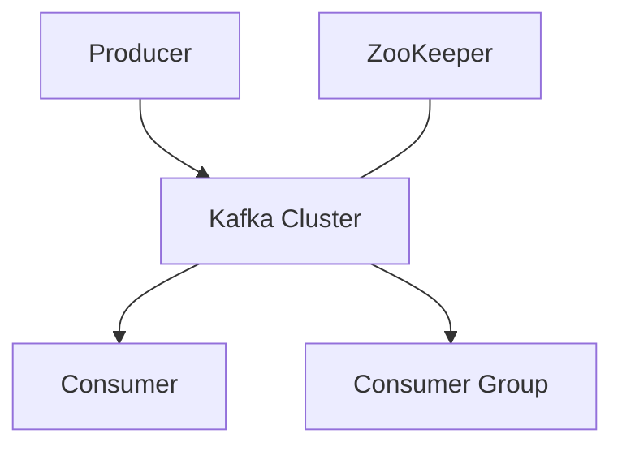

# 深入解析Kafka原理: 高性能分布式流处理平台

## 1. Kafka简介

Apache Kafka是一个分布式流处理平台，以其高吞吐量、可扩展性和容错性而闻名。它最初由LinkedIn开发，现已成为处理实时数据流的行业标准。

## 2. 核心概念

在深入Kafka原理之前，我们需要理解几个关键概念：

- **Topic**: 消息的逻辑分类
- **Partition**: Topic的物理分片
- **Producer**: 消息生产者
- **Consumer**: 消息消费者
- **Broker**: Kafka服务器
- **ZooKeeper**: 用于协调Kafka集群（注：新版本正在移除ZooKeeper依赖）

## 3. 架构设计

Kafka的架构可以用以下图表表示：



这个简化的架构图展示了Kafka的主要组件及其关系。

## 4. 工作原理

### 4.1 消息存储

Kafka的核心是基于追加日志的存储系统。每个分区都是一个有序、不可变的消息序列。

#### 日志结构
- 每个分区由多个日志段（LogSegment）组成
- 每个日志段对应一个文件，达到一定大小后会创建新的日志段
- 消息以追加的方式写入当前活跃的日志段

```java
public class LogSegment {
    private File file;
    private FileChannel channel;
    private long baseOffset;
    
    public void append(Record record) throws IOException {
        ByteBuffer buffer = record.serialize();
        channel.write(buffer);
    }
}
```

#### 索引机制
Kafka为每个日志段维护两种索引：
- 偏移量索引：映射消息偏移量到文件中的物理位置
- 时间戳索引：映射时间戳到消息偏移量

这些索引加速了消息的查找过程。

### 4.2 消息生产

#### 分区选择
Producer发送消息时，会根据以下规则选择分区：
1. 如果指定了分区，直接使用
2. 如果没有指定分区但有key，对key进行哈希选择分区
3. 如果既没有分区也没有key，轮询选择分区

```java
public class DefaultPartitioner implements Partitioner {
    public int partition(String topic, Object key, byte[] keyBytes, Object value, byte[] valueBytes, Cluster cluster) {
        List<PartitionInfo> partitions = cluster.partitionsForTopic(topic);
        int numPartitions = partitions.size();
        if (keyBytes == null) {
            int nextValue = nextValue(topic);
            List<PartitionInfo> availablePartitions = cluster.availablePartitionsForTopic(topic);
            if (availablePartitions.size() > 0) {
                int part = Utils.toPositive(nextValue) % availablePartitions.size();
                return availablePartitions.get(part).partition();
            } else {
                return Utils.toPositive(nextValue) % numPartitions;
            }
        } else {
            return Utils.toPositive(Utils.murmur2(keyBytes)) % numPartitions;
        }
    }
}
```

#### 消息发送
1. Producer将消息序列化
2. 根据分区策略选择目标分区
3. 将消息添加到内存中的批次（batch）
4. 后台线程定期将批次发送到相应的Broker

### 4.3 消息复制

Kafka使用主从复制机制来保证数据的可靠性：
1. 每个分区有一个leader和多个follower
2. 所有的读写操作都通过leader进行
3. Follower通过向leader发送fetch请求来复制数据
4. ISR（In-Sync Replicas）机制确保只有跟上leader的follower才能被选为新leader

```java
public class ReplicaManager {
    public void replicateFromLeader(TopicPartition partition, long fetchOffset) {
        Broker leaderBroker = getLeaderBroker(partition);
        FetchRequest request = new FetchRequest(partition, fetchOffset);
        FetchResponse response = leaderBroker.fetch(request);
        appendToLocalLog(response.getRecords());
    }
}
```

### 4.4 消息消费

#### 消费者组
- 同一组的消费者共同消费一个主题的消息
- 每个分区只能被组内的一个消费者消费
- 消费者数量不应超过分区数，否则有消费者会闲置

#### 位移管理
- Kafka使用消费者位移（consumer offset）来记录消费进度
- 位移存储在内部主题 `__consumer_offsets` 中
- 消费者可以选择自动提交或手动提交位移

```java
public class KafkaConsumer<K, V> {
    public void commitSync() {
        Map<TopicPartition, OffsetAndMetadata> offsets = currentOffsets.entrySet().stream()
            .collect(Collectors.toMap(
                Map.Entry::getKey,
                e -> new OffsetAndMetadata(e.getValue())
            ));
        commitSync(offsets);
    }
}
```

### 4.5 消息分发

Kafka使用零拷贝技术高效地将消息从文件系统传输到网络：

```java
public class ZeroCopyFileReader {
    public long sendFile(FileChannel fileChannel, SocketChannel socketChannel, long position, long count) throws IOException {
        return fileChannel.transferTo(position, count, socketChannel);
    }
}
```

这种方式避免了在用户空间和内核空间之间的多次数据拷贝，显著提高了性能。

### 4.6 副本同步和领导者选举

#### ISR（In-Sync Replicas）机制
- ISR包含所有与leader保持同步的副本（包括leader自身）
- 只有ISR中的副本才有资格被选为新的leader
- 副本落后太多会被踢出ISR

#### 领导者选举
当leader副本失效时：
1. 控制器（Controller）检测到leader失效
2. 从ISR中选择第一个活跃的副本作为新leader
3. 其他follower开始从新leader同步数据

```java
public class ControllerContext {
    public void electNewLeader(TopicPartition partition) {
        List<Integer> isr = inSyncReplicas(partition);
        for (int brokerId : isr) {
            if (isAlive(brokerId)) {
                setNewLeader(partition, brokerId);
                break;
            }
        }
    }
}
```

### 4.7 数据清理

Kafka提供两种数据清理策略：
1. 基于时间的删除：保留特定时间段内的数据
2. 基于大小的删除：保留特定大小的数据

对于键值存储型场景，Kafka还提供了日志压缩（Log Compaction）功能，只保留每个key的最新值。

```java
public class LogCleaner {
    public void clean(TopicPartition partition) {
        Map<String, Record> latestRecordPerKey = new HashMap<>();
        for (Record record : readPartition(partition)) {
            latestRecordPerKey.put(record.key(), record);
        }
        writeCompactedLog(partition, latestRecordPerKey.values());
    }
}
```

## 5. 性能优化

Kafka的高性能源于多个精心设计的特性：

1. **顺序I/O**: 通过顺序写入和批量读取来最大化磁盘性能。

2. **零拷贝**: 直接从文件系统缓存传输到网络缓冲区，避免了不必要的数据拷贝。

3. **批处理**: 生产者和消费者都支持消息批处理，提高吞吐量。

4. **压缩**: 支持多种压缩算法，减少网络传输和存储开销。

5. **分区并行**: 主题分区允许并行处理和负载均衡。

## 6. 实用技巧

1. **合理设置分区数**: 分区数过少可能导致并行度不足，过多则增加开销。根据预期吞吐量和消费者数量来设置。

2. **监控关键指标**: 如生产者和消费者的延迟、Broker的磁盘使用率等。

3. **定期清理日志**: 使用日志清理策略避免无限制的磁盘使用。

4. **优化生产者配置**:

   ```java
   Properties props = new Properties();
   props.put("batch.size", 16384);
   props.put("linger.ms", 1);
   props.put("compression.type", "snappy");
   ```

5. **使用键来保证消息顺序**: 相同键的消息会被发送到同一分区。

## 7. 结论

Kafka的设计理念和实现细节使其成为处理大规模实时数据流的理想选择。通过深入理解Kafka的原理，开发者可以更好地利用其特性，构建高效、可靠的分布式系统。