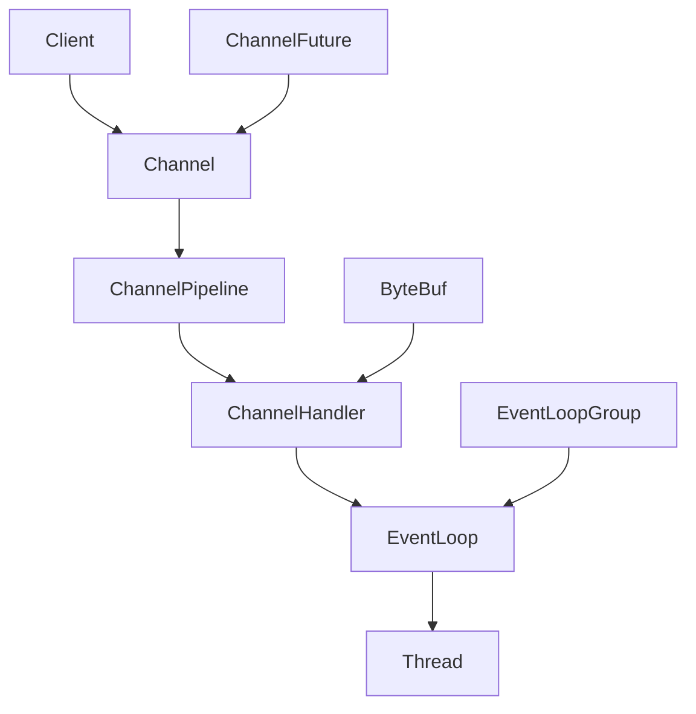

# Netty原理深度解析：高性能网络应用框架

## 1. Netty简介

Netty是一个异步事件驱动的网络应用框架，用于快速开发可维护的高性能协议服务器和客户端。它极大地简化了TCP和UDP套接字服务器等网络编程。

## 2. 核心概念

在深入Netty原理之前，我们需要理解几个关键概念：

- **Channel**: 网络套接字的抽象
- **EventLoop**: 处理I/O操作的核心抽象
- **ChannelPipeline**: 处理或拦截入站和出站事件的链
- **ChannelHandler**: 处理I/O事件或拦截I/O操作的接口
- **ByteBuf**: 高效的字节容器

## 3. 架构设计

Netty的架构设计是其高性能和灵活性的关键。下面是Netty的核心架构图及详细说明：



### 3.1 核心组件解析

1. **Channel**
   - 代表一个网络连接的抽象
   - 负责网络I/O操作，如读、写、连接、绑定等
   - 常见实现：NioSocketChannel, NioServerSocketChannel

2. **ChannelPipeline**
   - 包含一系列的ChannelHandler
   - 定义了处理入站和出站事件的流水线
   - 支持动态添加、删除ChannelHandler

3. **ChannelHandler**
   - 处理I/O事件或拦截I/O操作
   - 转换数据格式、处理异常等
   - 分为入站处理器(ChannelInboundHandler)和出站处理器(ChannelOutboundHandler)

4. **EventLoop**
   - 处理所有I/O操作的核心
   - 通常一个EventLoop可以处理多个Channel
   - 保证一个Channel的所有I/O事件都由同一个Thread处理，避免同步问题

5. **EventLoopGroup**
   - 包含一个或多个EventLoop
   - 用于管理和分配EventLoop给Channel
   - 可以根据需求配置多个EventLoopGroup，如分离I/O操作和耗时任务

6. **ByteBuf**
   - Netty的数据容器，替代Java NIO的ByteBuffer
   - 提供了更灵活和高效的字节缓冲区操作
   - 支持池化，减少内存分配和GC压力

7. **ChannelFuture**
   - 代表异步I/O操作的结果
   - 提供了添加监听器、等待操作完成等方法
   - 配合ChannelPromise使用，可以设置操作结果

### 3.2 数据流动过程

1. 客户端发起连接，Netty创建一个新的Channel。
2. Channel与一个EventLoop关联，该EventLoop负责处理这个Channel的所有I/O事件。
3. 入站数据（如客户端请求）通过Channel进入ChannelPipeline。
4. 数据依次经过ChannelPipeline中的ChannelInboundHandler处理。
5. 处理后的数据可能会转换为出站数据（如服务器响应）。
6. 出站数据依次经过ChannelOutboundHandler处理。
7. 最终通过Channel写回客户端。

### 3.3 设计优势

1. **高度模块化**：各组件职责清晰，易于扩展和定制。
2. **异步非阻塞**：基于事件驱动模型，高效处理并发连接。
3. **线程模型灵活**：可以根据需求配置EventLoopGroup，优化资源使用。
4. **零拷贝支持**：减少数据在内核空间和用户空间的拷贝，提高性能。
5. **丰富的协议支持**：内置多种编解码器，便于开发各类网络应用。

### 3.4 示例：构建服务器

以下代码展示了如何使用Netty的核心组件构建一个简单的服务器：

```java
public class NettyServer {
    public static void main(String[] args) throws Exception {
        EventLoopGroup bossGroup = new NioEventLoopGroup(1);
        EventLoopGroup workerGroup = new NioEventLoopGroup();
        try {
            ServerBootstrap b = new ServerBootstrap();
            b.group(bossGroup, workerGroup)
             .channel(NioServerSocketChannel.class)
             .childHandler(new ChannelInitializer<SocketChannel>() {
                 @Override
                 public void initChannel(SocketChannel ch) throws Exception {
                     ch.pipeline().addLast(new EchoServerHandler());
                 }
             });

            ChannelFuture f = b.bind(8080).sync();
            f.channel().closeFuture().sync();
        } finally {
            workerGroup.shutdownGracefully();
            bossGroup.shutdownGracefully();
        }
    }
}
```

## 4. 工作原理

### 4.1 Reactor模式

Netty基于Reactor模式，实现了高效的事件处理模型。

```java
public class Reactor implements Runnable {
    final Selector selector;
    final ServerSocketChannel serverSocket;

    Reactor(int port) throws IOException {
        selector = Selector.open();
        serverSocket = ServerSocketChannel.open();
        serverSocket.socket().bind(new InetSocketAddress(port));
        serverSocket.configureBlocking(false);
        SelectionKey sk = serverSocket.register(selector, SelectionKey.OP_ACCEPT);
        sk.attach(new Acceptor());
    }

    public void run() {
        try {
            while (!Thread.interrupted()) {
                selector.select();
                Set<SelectionKey> selected = selector.selectedKeys();
                Iterator<SelectionKey> it = selected.iterator();
                while (it.hasNext()) {
                    dispatch(it.next());
                }
                selected.clear();
            }
        } catch (IOException ex) { /* ... */ }
    }

    void dispatch(SelectionKey k) {
        Runnable r = (Runnable)(k.attachment());
        if (r != null) {
            r.run();
        }
    }

    class Acceptor implements Runnable {
        public void run() {
            try {
                SocketChannel c = serverSocket.accept();
                if (c != null)
                    new Handler(selector, c);
            } catch (IOException ex) { /* ... */ }
        }
    }
}
```

### 4.2 EventLoop线程模型

Netty的EventLoop负责处理所有的I/O事件和任务。它的核心逻辑包括选择就绪的I/O事件、处理这些事件，以及运行队列中的任务。

```java
public final class NioEventLoop extends SingleThreadEventLoop {
    private final Selector selector;
    private final SelectorProvider provider;

    NioEventLoop(NioEventLoopGroup parent, ThreadFactory threadFactory, SelectorProvider selectorProvider) {
        super(parent, threadFactory, false);
        this.provider = selectorProvider;
        this.selector = openSelector();
    }

    protected void run() {
        for (;;) {
            try {
                select();
                processSelectedKeys();
                runAllTasks();
            } catch (Throwable t) {
                handleLoopException(t);
            }
        }
    }

    private void select() throws IOException {
        Selector selector = this.selector;
        try {
            int selectCnt = 0;
            long currentTimeNanos = System.nanoTime();
            long selectDeadLineNanos = currentTimeNanos + delayNanos(currentTimeNanos);
            for (;;) {
                long timeoutMillis = (selectDeadLineNanos - currentTimeNanos + 500000L) / 1000000L;
                if (timeoutMillis <= 0) {
                    if (selectCnt == 0) {
                        selector.selectNow();
                        selectCnt = 1;
                    }
                    break;
                }

                int selectedKeys = selector.select(timeoutMillis);
                selectCnt ++;

                if (selectedKeys != 0 || oldWakenUp || wakenUp.get() || hasTasks() || hasScheduledTasks()) {
                    break;
                }
                if (Thread.interrupted()) {
                    break;
                }

                currentTimeNanos = System.nanoTime();
                if (currentTimeNanos >= selectDeadLineNanos) {
                    selectCnt = 1;
                    break;
                }
            }

            if (selectCnt > MIN_PREMATURE_SELECTOR_RETURNS) {
                logger.warn("Selector.select() returned prematurely {} times in a row; rebuilding Selector {}.",
                        selectCnt, selector);
                rebuildSelector();
                selector = this.selector;
            }
        } catch (CancelledKeyException e) {
            // Harmless exception - log anyway
            logger.warn("Selector.select() threw CancelledKeyException.", e);
        }
    }

    private void processSelectedKeys() {
        Set<SelectionKey> selectedKeys = selector.selectedKeys();
        if (selectedKeys.isEmpty()) {
            return;
        }
        Iterator<SelectionKey> i = selectedKeys.iterator();
        for (;;) {
            final SelectionKey k = i.next();
            final Object a = k.attachment();
            i.remove();
            if (a instanceof AbstractNioChannel) {
                processSelectedKey(k, (AbstractNioChannel) a);
            } else {
                @SuppressWarnings("unchecked")
                NioTask<SelectableChannel> task = (NioTask<SelectableChannel>) a;
                processSelectedKey(k, task);
            }
            if (!i.hasNext()) {
                break;
            }
        }
    }

    private void processSelectedKey(SelectionKey k, AbstractNioChannel ch) {
        final AbstractNioChannel.NioUnsafe unsafe = ch.unsafe();
        if (!k.isValid()) {
            unsafe.close(unsafe.voidPromise());
            return;
        }

        try {
            int readyOps = k.readyOps();
            if ((readyOps & SelectionKey.OP_CONNECT) != 0) {
                int ops = k.interestOps();
                ops &= ~SelectionKey.OP_CONNECT;
                k.interestOps(ops);
                unsafe.finishConnect();
            }
            if ((readyOps & SelectionKey.OP_WRITE) != 0) {
                ch.unsafe().forceFlush();
            }
            if ((readyOps & (SelectionKey.OP_READ | SelectionKey.OP_ACCEPT)) != 0 || readyOps == 0) {
                unsafe.read();
            }
        } catch (CancelledKeyException ignored) {
            unsafe.close(unsafe.voidPromise());
        }
    }

    protected boolean runAllTasks(long timeoutNanos) {
        fetchFromScheduledTaskQueue();
        Runnable task = pollTask();
        if (task == null) {
            return false;
        }

        final long deadline = ScheduledFutureTask.nanoTime() + timeoutNanos;
        long runTasks = 0;
        long lastExecutionTime;
        for (;;) {
            try {
                task.run();
            } catch (Throwable t) {
                logger.warn("A task raised an exception.", t);
            }

            runTasks++;
            if ((runTasks & 0x3F) == 0) {
                lastExecutionTime = ScheduledFutureTask.nanoTime();
                if (lastExecutionTime >= deadline) {
                    break;
                }
            }

            task = pollTask();
            if (task == null) {
                lastExecutionTime = ScheduledFutureTask.nanoTime();
                break;
            }
        }

        return true;
    }
}
```

#### processSelectedKeys() 解析

1. **获取选择的键**: 从selector中获取所有已就绪的SelectionKey。

2. **遍历处理**: 对每个SelectionKey进行处理。

3. **识别附加对象**: 检查SelectionKey的附加对象，可能是Channel或NioTask。

4. **处理I/O事件**: 
   - 对于连接完成事件(OP_CONNECT)，完成连接过程。
   - 对于可写事件(OP_WRITE)，执行强制刷新。
   - 对于可读事件(OP_READ)或接受连接事件(OP_ACCEPT)，执行读取操作。

5. **异常处理**: 如果遇到CancelledKeyException，关闭相关的Channel。

#### runAllTasks() 解析

1. **任务获取**: 从调度任务队列中获取任务，并轮询普通任务队列。

2. **执行任务**: 在指定的时间内执行尽可能多的任务。

3. **时间控制**: 使用deadline来控制任务执行的总时间，防止长时间占用EventLoop。

4. **定期检查**: 每执行64个任务后，检查是否超时。

5. **异常处理**: 捕获并记录任务执行过程中的异常，确保一个任务的异常不会影响其他任务的执行。

这个设计确保了EventLoop能够高效地处理I/O事件和执行任务，同时保持对系统资源的合理使用。通过在一个循环中交替处理I/O事件和执行任务，Netty实现了高效的事件驱动模型，能够快速响应网络事件，同时处理相关的业务逻辑。

### 4.3 零拷贝

Netty通过使用直接内存缓冲区和底层优化实现了零拷贝，提高了数据传输效率。

```java
public abstract class AbstractNioChannel extends AbstractChannel {
    protected final int doReadBytes(ByteBuf byteBuf) throws Exception {
        final RecvByteBufAllocator.Handle allocHandle = unsafe().recvBufAllocHandle();
        allocHandle.attemptedBytesRead(byteBuf.writableBytes());
        return byteBuf.writeBytes(javaChannel(), allocHandle.attemptedBytesRead());
    }
}
```

### 4.4 ChannelPipeline

ChannelPipeline提供了一个强大的机制来处理入站和出站事件。

```java
public class EchoServerHandler extends ChannelInboundHandlerAdapter {
    @Override
    public void channelRead(ChannelHandlerContext ctx, Object msg) {
        ctx.write(msg);
    }

    @Override
    public void channelReadComplete(ChannelHandlerContext ctx) {
        ctx.flush();
    }

    @Override
    public void exceptionCaught(ChannelHandlerContext ctx, Throwable cause) {
        cause.printStackTrace();
        ctx.close();
    }
}
```

### 4.5 ByteBuf

Netty的ByteBuf是一个强大的字节容器，它克服了Java NIO ByteBuffer的一些限制。

```java
public final class ByteBuf {
    private final byte[] array;
    private int readerIndex;
    private int writerIndex;

    public ByteBuf(int capacity) {
        array = new byte[capacity];
    }

    public ByteBuf writeBytes(byte[] src) {
        int length = src.length;
        ensureWritable(length);
        System.arraycopy(src, 0, array, writerIndex, length);
        writerIndex += length;
        return this;
    }

    public ByteBuf readBytes(byte[] dst) {
        int length = dst.length;
        checkReadableBytes(length);
        System.arraycopy(array, readerIndex, dst, 0, length);
        readerIndex += length;
        return this;
    }
}
```

## 5. 性能优化

Netty的高性能源于多个精心设计的特性：

1. **异步非阻塞I/O**: 基于Java NIO，实现高效的事件驱动模型。

2. **零拷贝**: 使用直接内存缓冲区，减少数据拷贝次数。

3. **内存池**: 通过重用ByteBuf来减少内存分配和GC压力。

4. **高效的协议编解码**: 提供了丰富的编解码器，如protobuf、thrift等。

5. **灵活的线程模型**: 可以根据需求配置EventLoopGroup。

## 6. 实用技巧

1. **合理使用ChannelHandler**: 根据业务逻辑划分handler，保持单一职责。

2. **利用内存池**: 使用PooledByteBufAllocator来分配ByteBuf。

   ```java
   Bootstrap b = new Bootstrap();
   b.option(ChannelOption.ALLOCATOR, PooledByteBufAllocator.DEFAULT);
   ```

3. **处理背压**: 使用WRITE_BUFFER_WATER_MARK选项来控制写入缓冲区大小。

4. **选择合适的EventLoopGroup**: 对于CPU密集型任务，可以使用DefaultEventLoopGroup。

5. **使用FastThreadLocal**: Netty提供的FastThreadLocal比Java原生ThreadLocal更快。

## 7. 结论

Netty通过其精心设计的架构和优化策略，为开发高性能、可扩展的网络应用提供了强大的支持。深入理解Netty的原理，能够帮助开发者更好地利用其特性，构建高效、可靠的网络系统。


