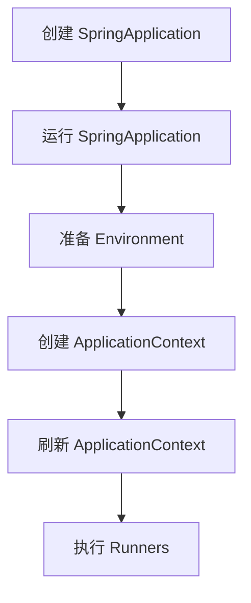

# Spring Boot 原理深度解析

Spring Boot 作为简化 Spring 应用开发的框架，其背后蕴含着诸多精妙的设计原理。本文将深入探讨 Spring Boot 的核心原理，包括自动配置、启动流程和核心注解的工作机制，为高级开发者提供全面的技术洞察。

## 1. 自动配置原理

Spring Boot 的自动配置是其最核心的特性之一，它极大地简化了应用的配置过程。

### 1.1 @EnableAutoConfiguration 注解

自动配置的魔法始于 `@EnableAutoConfiguration` 注解。这个注解通过 `@Import` 引入了 `AutoConfigurationImportSelector`，后者负责加载自动配置类。

```java
@Target(ElementType.TYPE)
@Retention(RetentionPolicy.RUNTIME)
@Documented
@Inherited
@AutoConfigurationPackage
@Import(AutoConfigurationImportSelector.class)
public @interface EnableAutoConfiguration {
    // ...
}
```

### 1.2 条件化配置

Spring Boot 广泛使用了 `@Conditional` 注解及其变体（如 `@ConditionalOnClass`, `@ConditionalOnMissingBean` 等）来实现条件化配置。

```java
@Configuration
@ConditionalOnClass(DataSource.class)
public class DataSourceAutoConfiguration {
    @Bean
    @ConditionalOnMissingBean
    public DataSource dataSource() {
        // 配置数据源
    }
}
```

### 1.3 自动配置的加载过程

1. 扫描 classpath 下的 `META-INF/spring.factories` 文件
2. 加载文件中 `org.springframework.boot.autoconfigure.EnableAutoConfiguration` 键对应的配置类
3. 筛选满足条件的配置类（基于 `@Conditional` 注解）
4. 应用筛选后的配置

## 2. Spring Boot 启动流程

Spring Boot 的启动过程是一个复杂而精密的过程，主要包括以下步骤：

1. 创建 `SpringApplication` 对象
2. 运行 `SpringApplication`
   - 准备 Environment
   - 创建 ApplicationContext
   - 刷新 ApplicationContext
   - 执行 runners

### 2.1 启动流程图



### 2.2 关键源码解析

以下是 `SpringApplication` 的 `run` 方法的简化版本，展示了主要的启动步骤：

```java
public ConfigurableApplicationContext run(String... args) {
    // 1. 创建并启动计时器
    StopWatch stopWatch = new StopWatch();
    stopWatch.start();
    
    ConfigurableApplicationContext context = null;
    try {
        // 2. 准备环境
        ConfigurableEnvironment environment = prepareEnvironment(listeners, applicationArguments);
        
        // 3. 创建 ApplicationContext
        context = createApplicationContext();
        
        // 4. 刷新 ApplicationContext
        refreshContext(context);
        
        // 5. 执行 Runners
        callRunners(context, applicationArguments);
    } catch (Throwable ex) {
        handleRunFailure(context, ex, listeners);
    }
    
    // 6. 停止计时并返回 context
    stopWatch.stop();
    return context;
}
```

## 3. 核心注解解析

Spring Boot 大量使用注解来简化配置和开发。以下是一些核心注解及其工作原理：

### 3.1 @SpringBootApplication

这是一个复合注解，等同于 `@Configuration`、`@EnableAutoConfiguration` 和 `@ComponentScan` 的组合。

```java
@Target(ElementType.TYPE)
@Retention(RetentionPolicy.RUNTIME)
@Documented
@Inherited
@SpringBootConfiguration
@EnableAutoConfiguration
@ComponentScan(excludeFilters = {
    @Filter(type = FilterType.CUSTOM, classes = TypeExcludeFilter.class),
    @Filter(type = FilterType.CUSTOM, classes = AutoConfigurationExcludeFilter.class) })
public @interface SpringBootApplication {
    // ...
}
```

### 3.2 @Configuration

标识一个类为配置类，等同于 XML 配置文件。

### 3.3 @Bean

标识一个方法产生一个 Bean 对象，交由 Spring 容器管理。

### 3.4 @Conditional

条件化配置的核心注解，根据特定条件来决定是否创建某个 Bean 或启用某个配置。

## 4. 实用技巧

1. **自定义自动配置**：创建自己的 `@Configuration` 类，并在 `META-INF/spring.factories` 文件中注册。

2. **排除自动配置**：使用 `@EnableAutoConfiguration(exclude = {DataSourceAutoConfiguration.class})` 来排除特定的自动配置。

3. **自定义 Banner**：在 `resources` 目录下创建 `banner.txt` 文件来自定义启动 Banner。

4. **配置文件优先级**：了解 `application.properties`、`application.yml` 和外部配置的优先级顺序。

5. **使用 Actuator**：集成 Spring Boot Actuator 来监控和管理应用。

## 总结

Spring Boot 通过自动配置、条件化配置和注解驱动等核心原理，大大简化了 Spring 应用的开发过程。深入理解这些原理不仅有助于更好地使用 Spring Boot，还能在遇到问题时快速定位和解决。作为高级开发者，掌握这些原理将使你能够更灵活地定制和优化 Spring Boot 应用。